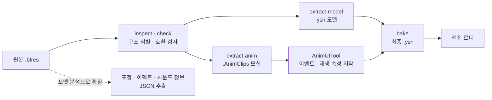

# DX11_3D_GameProject_Team

**DirectX 11 기반 3D 액션 플랫포머 — 「별의 커비 디스커버리」 모작 (4인 팀 프로젝트)**

[개요](#개요) · [하이라이트](#하이라이트) · [내 담당](#내-담당) · [설계 및 구조](#설계-및-구조) · [주요 구현](#주요-구현) · [구현 콘텐츠](#구현-콘텐츠) · [툴](#툴) · [트러블 슈팅](#트러블-슈팅) · [기술 스택](#기술-스택)

---

## 개요

교육 과정에서 받은 컴포넌트 기반 엔진 프레임워크를 팀이 확장해 만든 「별의 커비 디스커버리」 모작입니다. 이 README는 **몬스터 AI · 애니메이션 시스템 · 원작 리소스 파이프라인과 툴을 맡은 차호준(ddoichaboom)의 작업**을 중심으로 정리했습니다.

| | |
| --- | --- |
| 기간 | 2026.05.28 ~ 2026.08.02 (약 10주) |
| 인원 | 4인 |
| 규모 | 내 커밋 195(머지 제외) · 몬스터 16종 · 공용 몬스터 상태 16종 · 개별 이펙트 30종 · 툴 7종 |

| 팀원 | 담당 |
| --- | --- |
| [Marb1e0817](https://github.com/Marb1e0817) | 팀장 · 렌더링 · 엔진 코어 · 보스 AI · UI · 카메라 |
| [yoonseungeon](https://github.com/yoonseungeon) | 플레이어(커비) · 능력 복사 · 변신 · 이펙트 시스템 |
| [leolee-12](https://github.com/leolee-12) | 레벨 · 맵 툴 · 맵 로더 · 환경 오브젝트 · 컬링 |
| **[ddoichaboom](https://github.com/ddoichaboom)** | **몬스터 AI · 애니메이션 시스템 · 원작 리소스 파이프라인 · 툴** |

---

## 하이라이트

<table>
  <tr>
    <td width="50%"><br/><sub><b>포탑 예측 발사</b> — 용암 롤러코스터 위 커비를 고정 포탑이 앞질러 겨냥</sub></td>
    <td width="50%"><br/><sub><b>드랍 별</b> — 보스가 팔을 휘두르면 별이 호를 따라 퍼짐</sub></td>
  </tr>
  <tr>
    <td><br/><sub><b>압착</b> — 자동차 커비에 치인 몬스터가 납작해지며 사라짐</sub></td>
    <td><br/><sub><b>AnimUITool</b> — 애니메이션 이벤트로 넣은 별 배치 프리셋을 툴에서 바로 확인</sub></td>
  </tr>
</table>

---

## 내 담당

**몬스터 AI**
- 지각 · 판단 · 실행을 나눈 몬스터 AI 프레임워크와 공용 상태 16종
- 몬스터 16종 구현 (전용 판단 · 상태 14종, 공용 상태만 쓰는 2종)
- 이동 컴포넌트 · 레일 이동 · 흡입 / 뱉기 / 압착 같은 커비 상호작용

**애니메이션**
- Animator에 본 마스킹 · 재생 큐 · 오버레이 레이어 스택 증축
- 애니메이션 이벤트 저작 툴 AnimUITool

**원작 리소스 파이프라인 · 툴**
- 원작 `.bfres`를 엔진 포맷으로 바꾸는 변환 툴 AnimModelTool(C#)
- 텍스처 재베이크 · 폰트 · 사운드 판별 · 인코딩 검사 같은 보조 툴

**기믹 · 오브젝트**
- 포탑 예측 발사 · 낙하암 · 드랍 별 · 능력 방울 · 폭탄 탄도

**사운드 · 최적화 · 이펙트**
- 사운드 핸들 · BGM 페이드 · 환경음 재생, 몬스터 · 보스 사운드 배선
- 거리에 따라 몬스터 애니메이션 갱신 주기를 나누는 최적화
- 개별 이펙트 30종 (피격 · 소멸 · 폭발 · 먼지 · 오라 등)

> 커비 조작 · 능력 복사 · 변신, 보스 AI 본체, 렌더링 · 엔진 코어, 맵 툴 · 레벨, 이펙트 시스템 코어는 팀원 작업입니다.

---

## 설계 및 구조

### 몬스터 AI

<p align="center">
  
  <br/><sub>프레임마다 지각 → 판단 → 실행 순서로 한 번씩 — 판단은 블랙보드를 읽기만 한다</sub>
</p>

| 계층 | 클래스 | 책임 |
| --- | --- | --- |
| 지각 | `MONSTER_BLACKBOARD` | 거리(3D · 수평 · 높이) · 시야 · 전이 가능 여부를 프레임당 한 번 기록 |
| 판단 | `CMonsterBrain` → `CMonster_Brain_FSM` → 몬스터별 Brain | 블랙보드를 읽고 `Change_State`만 호출 |
| 실행 | `CMonster_StateMachine` + `CMonster_State` 파생 | Enter · Update · Exit, 애니메이션 재생과 이동 |
| 행동 | `CMonster_Movement` · `CMonster` 베이스 | 회전 · 이동 속도 · 피격 · 사망 공통 처리 |

### 원작 리소스 → 엔진



---

## 주요 구현

### 1. 몬스터 AI 프레임워크

몬스터 담당 1인이 14종 이상을 만들어야 했는데, 몬스터마다 다른 것은 "언제 무엇을 할지"라는 판단뿐이고 이동 · 피격 · 사망 · 흡입 같은 실행은 대부분 같았습니다. 그래서 **판단(Brain)과 실행(State)을 나누고 실행 상태를 공용화**했습니다.

<table>
  <tr>
    <td width="50%"><br/><sub><b>NormalEnemy 추격</b> — 커비를 발견하고 쫓아옴</sub></td>
    <td width="50%"><br/><sub><b>NormalEnemy 피격</b> — 공격 반대 방향으로 튕겨 날아감</sub></td>
  </tr>
  <tr>
    <td><br/><sub><b>AI 변종 · 고정형</b> — BladeKnight가 자리를 지킨 채 커비 쪽으로 공격</sub></td>
    <td><br/><sub><b>AI 변종 · 추격형</b> — 같은 BladeKnight가 커비를 쫓아가 공격</sub></td>
  </tr>
</table>

<details>
<summary><b>세부 구현 사항</b></summary>

**블랙보드**
- 지각 결과는 몬스터가 프레임당 한 번만 블랙보드에 기록하고, Brain과 상태는 읽기만 함
- 상태가 늘어도 프레임당 연산량이 늘지 않음

**공용 상태**
- 이동 · 피격 · 사망 등 공용 상태 16종은 애니메이션 클립만 바꿔 여러 몬스터가 나눠 씀
- 몬스터는 필요한 상태만 등록
- 추격 · 순찰 · 후퇴는 이동 상태를 베이스로 함수만 오버라이드하는 템플릿 메서드 구조

**상태 교체**

<p align="center">
  
  <br/><sub>몬스터마다 등록한 상태 중에서 교체 — 이전 상태 정리 → 이전 상태를 넘기며 새 상태 진입 → 애니메이션 재생</sub>
</p>

- 몬스터에 등록된 상태로만 전환
- 이전 상태의 Exit에는 다음 상태를, 새 상태의 Enter에는 이전 상태를 넘겨 어디서 왔는지에 따라 이어지는 연출을 고름
- 전환할 때 블랙보드의 전환 가능 여부를 새 상태의 끊김 허용 여부로 갱신하고, 판단 쪽(`Can_Decide`)은 이 값과 경직 · 흡입 · 사망 상태를 한곳에서 확인

**AI 변종 (Variant)**
- 원작 배치 데이터의 변종 값(`Wait` · `WaitPursuit` 등)을 몬스터가 AIType으로 받아, 같은 클래스 안에서 행동이 갈림
- BladeKnight 추격형은 수평 거리 2.5 안이면 공격하고, 밖이면 추격
- BladeKnight 고정형은 추격하지 않고 제자리에서 공격 · 공격 · 회오리 순서로 공격
- 공격 패턴은 Brain이 상태 배열을 순서대로 돌며 고름

**애니메이션 주도 이동**
- 이동은 애니메이션 이벤트의 이동 구간에서만 적용해, 공격 중 전진 타이밍을 애니메이션 데이터로 맞춤

**팀 채택**
- 팀원이 같은 Brain 베이스를 상속해 보스 AI(`CBoss_Brain : CMonsterBrain`)를 구현

</details>

### 2. 이동 · 레일 이동

몬스터는 걷기 · 비행 · 레일 등 움직이는 방식이 제각각이라, **상태는 이동 방향만 요청하고 실제 이동은 이동 컴포넌트가 맡게** 했습니다.

<table>
  <tr>
    <td width="50%"><br/><sub><b>레일 이동</b> — Kabu가 원형 화단을 따라 돌며 진행 방향을 바라봄</sub></td>
    <td width="50%"><br/><sub><b>공중 레일</b> — BrontoBurt가 공중 경로를 따라 비행</sub></td>
  </tr>
</table>

<details>
<summary><b>세부 구현 사항</b></summary>

**이동 컴포넌트**
- 상태는 이동 방향만 요청하고, Movement가 속도 · 회전 · 중력을 적용해 PhysX 캐릭터 컨트롤러로 이동 · 접지 판정
- 현재 바라보는 방향과 목표 방향의 내적으로 각도, 외적 부호로 좌우를 구해 프레임당 정해진 속도로 회전

**레일 이동**
- 레일 몬스터는 Movement를 상속한 `Monster_RailMovement`로 원작 배치 데이터의 레일 경로(직선 · 베지어 · 원)를 그대로 따라 이동
- 원작 데이터 구조에 맞춰 레일 이동 구조를 먼저 잡고, 임시 경로로 검증한 뒤 실제 배치 데이터로 전환
- 진행 거리를 누적해 해당 구간과 구간 비율을 찾고, 위치와 접선을 함께 계산
- 곡선에서도 접선 방향을 바라보고, 역주행할 때는 접선을 뒤집음

</details>

### 3. 피격 · 흡입 · 압착

커비와의 상호작용을 몬스터마다 따로 만들지 않도록, 피격 정보 구조체와 흡입 인터페이스, 공용 상태로 표준화했습니다.

<table>
  <tr>
    <td width="50%"><br/><sub><b>피격</b> — 공격 반대 방향으로 튕겨 날아감</sub></td>
    <td width="50%"><br/><sub><b>흡입</b> — 작아지며 커비 입 쪽으로 빨려 듦</sub></td>
  </tr>
  <tr>
    <td><br/><sub><b>뱉기</b> — 머금었던 몬스터를 뱉어 공격</sub></td>
    <td><br/><sub><b>압착</b> — 자동차 커비에 치이면 납작해지며 사라짐</sub></td>
  </tr>
</table>

<details>
<summary><b>세부 구현 사항</b></summary>

**피격**
- 공격자 위치 · 피해량 · 밀리는 강도를 구조체 하나로 받아 보관
- 수평 방향은 공격자 반대쪽, 수직 속도는 같은 강도에 배율을 곱해 위로 뜨며 날아감

**흡입**
- 흡입 인터페이스(`IInhalable`)로 흡입 가능 여부와 줄 능력을 반환
- 빨려 들 때는 컨트롤러 · 콜라이더를 끄고 0.15배까지 줄며 입 쪽으로 가속

**뱉기**
- 발사체가 머금은 대상을 넘겨받아, 몸 중심 뼈를 회전 중심으로 진행 방향 축 회전

**압착**
- 차량 · 해머 같은 짓누르는 공격을 지면에서 맞으면 납작해지며 사라짐 (Y 0.12배 · XZ 1.25배)
- 공중에서 맞으면 사망 연출

</details>

### 4. Animator 레이어 · 마스킹

팀 초기 Animator는 클립 하나를 재생하는 골격이었습니다. 걸으면서 공격하거나 무기를 든 모습처럼 **부위마다 다른 클립을 재생**하기 위해 마스킹 · 재생 큐 · 레이어를 차례로 붙였습니다.

<table>
  <tr>
    <td width="50%"><br/><sub><b>기본 대기</b> — 양팔을 흔드는 베이스 애니메이션</sub></td>
    <td width="50%"><br/><sub><b>무기를 든 대기</b> — 해머를 든 팔의 본만 레이어로 덮어써, 다른 팔은 기본 대기 동작 그대로</sub></td>
  </tr>
</table>

<details>
<summary><b>세부 구현 사항</b></summary>

**본 마스킹**
- 시작 본 이름만 주면 본 배열을 한 번 훑어 그 아래 전체를 마스크로 채움
- 시작 본을 여러 개 지정 가능

**재생 큐**
- `Play`는 큐를 비우고 재생, `Enqueue`는 다음 클립을 예약
- 선딜 → 본타가 상태 코드 두 줄로 끝남

**레이어 스택 (최대 4)**
- 0번은 베이스, 위 레이어는 클립을 샘플링해 마스크 본의 지역 행렬만 가중치만큼 덮어씀
- 레이어마다 클립 · 마스크 · 가중치 · 자체 시간을 따로 둬 서로 간섭 없이 각자 속도로 재생
- 같은 레이어에 다른 클립이 오면 이전 포즈와 교차 보간
- 모든 레이어를 적용한 뒤 부모부터 자식 순으로 행렬을 한 번만 결합해, 레이어가 늘어도 계산이 겹치지 않음

**팀원 사용**
- 커비 소드 오버레이 등 팀원 코드가 이 API를 사용
- 리팩토링 때도 기존 API를 유지해 사용하던 코드를 깨지 않음

```cpp
// Anim_Layer.h — 레이어 하나가 가진 상태 (요약)
struct LAYER
{
    _string         strClip;                    // 재생 중 클립 ("" = 비활성)
    _float          fLocalTime = { 0.f };       // 레이어 자체 시간
    _float          fClipBlend = { 0.f };       // 클립 교차 보간
    _int            iPrevAnimIndex = { -1 };    // 이전 클립 상태 보존
    _float          fWeight = { 0.f };          // 가중치 페이드 인 / 아웃
    _float          fSpeed = { 1.f };           // 레이어별 재생 제어
    _bool           bLoop = { true };
    _bool           bPaused = { false };
    vector<_uint>   MaskBones;                  // 마스크 본 인덱스
    // ...
};
```

<sub>전체 코드 · [`Anim_Layer.h`](https://github.com/ddoichaboom/DX11_3D_GameProject_Team/blob/main/AAA/Engine/Public/Anim_Layer.h)</sub>

</details>

> Animator 골격과 애니메이션 이벤트 발화 구조는 팀장이 만들었고, 그 위의 마스킹 · 재생 큐 · 레이어를 설계 · 구현했습니다.

### 5. 원작 리소스 파이프라인 (AnimModelTool)

원작 `.bfres`를 교환 포맷(fbx 등)으로 거치면 여러 장의 머티리얼 텍스처가 한 장으로 뭉개지고 대량 변환도 어려워서, 팀은 **파싱 라이브러리(BfresLibrary)로 엔진 포맷에 바로 변환**하는 방향을 택했습니다. 팀장이 만든 초안 변환기를 바탕으로, 검사 · 분리 추출 · 베이크와 포맷 분석까지 담은 **11개 명령의 C# 툴 AnimModelTool**을 만들었습니다.

<details>
<summary><b>세부 구현 사항</b></summary>

**검사 먼저**
- `inspect`(구조 식별) · `check`(모델 ↔ 모션 호환성 3분류)로 변환 전에 문제를 확인

**모델 · 모션 분리**
- 모델은 `.ysh`, 모션은 여러 클립을 묶은 `.AnimClips`로 따로 추출
- 둘은 **본 이름**으로 연결 (BFRES에는 모델 ↔ 모션 대응표가 없음)
- AnimUITool에서 저작한 모션을 모델과 합쳐 최종 `.ysh`로 베이크

**포맷 분석으로 확장**
- 텍스처 패턴 애니메이션(표정), `.ptcl`(이펙트 컨테이너), 사운드 정보까지 JSON으로 추출

**결과 · 운영**
- 몬스터 · 보스 모델과 모션 전량, 이펙트 텍스처 3,773장 · 메시 929개 일괄 변환
- 배치 메뉴(`Export_From_Import.bat`)와 단독 실행 배포로, `Import` 폴더에 넣고 실행하면 되는 팀 공용 툴로 운영

```
inspect · check · extract-model · extract-anim · extract-animinfo · ptcl-inspect · ptcl-extract
extract-soundinfo · bake · bake-ysh · probe-rm
```

</details>

> 직접 변환 방향과 초안 변환기(BFRES_Converter) · `.ysh` 포맷은 팀장 작업이고, 그 위의 파이프라인 · 포맷 분석 · 배치 운영을 맡았습니다.

### 6. 애니메이션 이벤트 저작 툴 (AnimUITool)

공격 판정 · 이펙트 · 사운드 · 이동 구간을 코드에 시간으로 적지 않도록, **애니메이션 타임라인 위에서 이벤트를 배치하고 바로 재생해 보는 툴**을 만들었습니다.

<table>
  <tr>
    <td width="50%"><br/><sub><b>이벤트 타임라인</b> — 이벤트를 타임라인에 놓고 재생해 바로 확인</sub></td>
    <td width="50%"><br/><sub><b>배치 · 상호작용</b> — 툴 안에 커비와 몬스터를 배치하고 직접 조작</sub></td>
  </tr>
</table>

<details>
<summary><b>세부 구현 사항</b></summary>

**게임과 같은 환경**
- 런처와 같은 Engine · GameContent 위에 실행 파일만 따로 둬, 게임과 같은 경로로 리소스를 올리고 같은 객체를 확인
- 브라우저 패널로 모델을 미리 보고, 애니메이션 모델은 본 구조와 위치 표시
- 팩토리를 통해 게임 오브젝트를 팔레트에서 직접 배치하고, 커비와 몬스터를 조작해 상호작용 확인

**이벤트 타임라인**
- 클립 길이와 무관하게 0 ~ 1로 정규화한 하나의 타임라인 사용
- 이벤트는 점, 구간 이벤트는 시작 · 끝을 따로 조절
- 이벤트는 타입별로 정수 · 문자열 값을 전달 (예: 드랍 별 프리셋 이름을 문자열로 넣으면 툴과 게임 모두 적용)

**툴 ↔ 게임**
- 이벤트는 JSON으로 저장하고 게임이 같은 파일을 읽음
- 툴에서 맞춘 타이밍이 인게임에서 그대로 동작

</details>

### 7. 포탑 예측 발사 · 낙하암

롤러코스터 구간의 고정 포탑과 화산 구간의 낙하암을 만들었습니다. 포탑은 포신이 고정되어 있어 **조준 대신 발사 시점을 계산**합니다.

<table>
  <tr>
    <td width="50%"><br/><sub><b>고정 포탑</b> — 롤러코스터로 지나가는 커비를 예측 발사</sub></td>
    <td width="50%"><br/><sub><b>낙하암</b> — 화염을 끌며 떨어져 목표 지점에서 폭발</sub></td>
  </tr>
</table>

<details>
<summary><b>세부 구현 사항</b></summary>

**고정 포탑 (Gigatzo)**

<p align="center">
  
  <br/><sub>탄이 날아가는 동안 표적이 갈 거리(fLead)가 표적이 최근접점까지 가야 할 거리(fForward)보다 길어지는 순간 발사</sub>
</p>

- 넓은 감지 범위로 표적 위치를 기록해 프레임 간 위치 차로 속도, 속도 변화로 가속도를 구함
- 표적 진행 경로와 포신 방향 직선의 최근접점으로 탄의 비행 거리를 구하고, 비행 시간 동안 표적이 갈 거리(가속 반영)만큼 앞을 노려 발사
- 표적이 한 번 지나갈 때 한 발만 쏘고, 지나간 뒤 일정 거리를 벗어나면 다시 장전

**낙하암 (Meteor)**
- 공중 시작점과 지면 목표점 두 좌표만 받아 그 사이를 내려오고, 목표를 지나치지 않게 멈춘 뒤 폭발
- 감지 콜라이더 · 트리거 박스로 플레이어를 감지하거나 특정 이벤트와 연결해 다양한 조건에서 낙하

```cpp
// CGigatzo_Brain — 표적 경로 L1(t)와 포신 직선 L2(s)의 최근접점 (요약)
const _vector vR = vTargetPos - vMuzzlePos;
const _float fB = XMVectorGetX(XMVector3Dot(vForward, vMuzzleDir));
const _float fD = XMVectorGetX(XMVector3Dot(vForward, vR));
const _float fE = XMVectorGetX(XMVector3Dot(vMuzzleDir, vR));
const _float fDenom = 1.f - fB * fB;                 // 두 방향이 평행하면 0
const _float fForward    = (fB * fE - fD) / fDenom;  // 표적이 최근접점까지 가야 할 거리
const _float fFlightDist = (fE - fB * fD) / fDenom;  // 탄의 비행 거리

const _float fT = s_fAnimDelay + fFlightDist / fBulletSpeed;
_float fEndSpeed = fTargetSpeed + m_fTargetAccel * fT;               // 등속 가정 없이 가속 반영
// ... 관측한 최대 속도로 상한
const _float fLead = 0.5f * (fTargetSpeed + fEndSpeed) * fT + s_fLeadBias;
```

<sub>전체 코드 · [`Gigatzo_Brain.cpp`](https://github.com/ddoichaboom/DX11_3D_GameProject_Team/blob/main/AAA/GameContent/Private/Gigatzo_Brain.cpp)</sub>

</details>

### 8. 드랍 별 · 능력 방울

보스전에서 떨어지는 별과 능력을 담은 방울을 **흡입할 수 있는 오브젝트**로 만들고, 둘 다 오브젝트 풀에서 꺼내 씁니다.

<table>
  <tr>
    <td width="50%"><br/><sub><b>SWEEP</b> — 팔을 휘두른 방향의 호를 따라 별이 나옴</sub></td>
    <td width="50%"><br/><sub><b>별 흡입 · 뱉기</b> — 보스가 뿌린 별을 흡입해 뱉으면 보스를 맞히는 공격이 됨</sub></td>
  </tr>
  <tr>
    <td colspan="2" align="center"><br/><sub><b>능력 방울</b> — 능력을 버리면 방울이 포물선을 그리며 날아가 떠다님</sub></td>
  </tr>
</table>

<details>
<summary><b>세부 구현 사항</b></summary>

**드랍 별**
- 보스 패턴에서 떨어지는 별을 흡입 전용 오브젝트로 만들고 오브젝트 풀로 전투 중 생성 비용 제거
- 배치 방식은 SWEEP(시전자 방향 기준 시작 각도부터 호를 따라)과 CIRCLE(원 안 면적에 고르게) 두 가지
- CIRCLE은 반지름을 난수의 제곱근에 비례하게 뽑아, 별이 가운데로 몰리지 않고 면적 전체에 고르게 퍼짐
- 배치 프리셋을 보스 애니메이션 이벤트에 이름으로 지정
- 일정 시간이 지나면 콜라이더 · 컨트롤러를 끄고 풀로 반환

**능력 방울**
- 공통 클래스 하나에 능력 값에 따라 모델과 획득 결과가 달라짐
- 모든 방울을 같은 풀에서 사용
- 받침대 방울은 주기적으로 다시 생기고, 버린 방울은 머리 위에서 뒤쪽으로 포물선을 그리며 던져짐
- 약한 중력 · 공기 저항에 두 축의 주기가 다른 흔들림을 더해 떠다니는 움직임
- 버린 방울만 흡입 인터페이스를 구현해 흡입으로 다시 획득 가능

</details>

### 9. 사운드 · 환경음

프레임워크의 사운드 매니저를 바탕으로 **재생 중인 소리를 안전하게 다루는 핸들**과 페이드 · 구간 반복을 더하고, 게임 전체 사운드를 배선했습니다.

<p align="center">
  
  <br/><sub>소리의 성격에 따라 공용 · 몬스터별 · 지속음 세 갈래로 배선</sub>
</p>

<details>
<summary><b>세부 구현 사항</b></summary>

**사운드 핸들**
- `CSound_Handle`은 FMOD 채널을 감싼 값 타입 핸들로, 이미 끝난 소리에 정지 · 볼륨 조절을 해도 안전
- 루프 재생 · BGM 페이드 · 구간 반복 BGM API 추가

**배선**
- 몬스터 공용 사운드 헬퍼와 몬스터별 사운드 맵을 두고, 보스까지 같은 방식으로 배선

**환경음**
- 레벨 담당이 만든 구역 오브젝트(AudioArea)에 재생 로직 구현
- 구역 표면까지의 최단 거리로 볼륨을 줄임
- 핸들을 유지한 채 볼륨만 바꿔 구역을 오가도 소리가 끊기지 않음

</details>

### 10. 거리 기반 애니메이션 갱신 주기

배치된 몬스터가 늘면서, 멀리 있어 잘 보이지도 않는 몬스터까지 매 프레임 뼈 애니메이션을 계산하는 비용이 커졌습니다. 렌더 컬링은 맵 담당이 만든 컬링 틀을 그대로 활용하고, 그 위에 **카메라와의 거리에 따라 애니메이션을 몇 프레임마다 갱신할지 정하는 로직**을 직접 설계했습니다.

| 카메라 ~ 몬스터 표면 거리 | 애니메이션 갱신 | 60fps 기준 |
| --- | --- | ---: |
| 65 미만 | 매 프레임 | 초당 60회 |
| 65 ~ 80 | 2프레임마다 | 초당 30회 |
| 80 이상 (화면에 보이는 범위) | 4프레임마다 | 초당 15회 |
| 컬링 거리 밖 (렌더 제외) | 8프레임마다 | 초당 7.5회 |

<details>
<summary><b>세부 구현 사항</b></summary>

**판단과 소비 분리**
- 몬스터 본체가 매 프레임 거리 구간 → 갱신 주기 → 이번 프레임이 갱신 차례인지를 계산해 `MONSTER_CULL_STATE`에 기록
- 몸체 · 모자 같은 파츠(`CMonsterPart`)는 이 값을 읽고 Animator 갱신 여부와 넘길 시간만 결정
- 파츠가 여럿이어도 판단은 한 번

**건너뛴 시간 누적**
- 갱신하지 않은 프레임의 시간을 누적해 두었다가 갱신 프레임에 한 번에 넘김
- 갱신 횟수만 줄고 애니메이션 진행 속도는 그대로 (4프레임마다 갱신하면 4프레임 분량을 한 번에 진행)
- 렌더에서 빠진 몬스터도 애니메이션을 멈추지 않고 8프레임마다 진행

**위상 분산**
- 몬스터마다 생성할 때 시작 위상(0 ~ 7)을 무작위로 정해, 같은 주기의 몬스터들이 같은 프레임에 몰려 갱신되지 않게 함

```
프레임               1  2  3  4  5  6  7  8
몬스터 A (위상 3)    ■  ·  ·  ·  ■  ·  ·  ·     같은 거리 · 같은 주기(4)여도
몬스터 B (위상 1)    ·  ·  ■  ·  ·  ·  ■  ·     갱신하는 프레임이 서로 다름
```

**예외 처리**
- 컬링 거리를 설정하지 않은 몬스터나 거리 계산이 실패한 경우는 매 프레임 갱신해, 최적화가 동작을 망가뜨리지 않게 함
- 에디터 모드에서는 시간을 누적하지 않음
- `s_bUseAnimURO` 스위치 하나로 모든 구간을 매 프레임 갱신으로 되돌려 전후 비교

```cpp
// CMonster::Update_CullGrade (요약)
const _uint iPeriod = Calc_AnimPeriod(tFade.fBoundaryDistance);    // 거리 구간 → 갱신 주기 (1 · 2 · 4 · 8)
m_fAnimAccum += fTimeDelta;                                         // 이번 프레임 시간 누적
++m_iCullFrame;
m_CullState.bAnimTick = (iPeriod <= 1)
    || (0 == ((m_iCullFrame + m_iCullPhase) % iPeriod));            // 몬스터마다 위상을 어긋나게
if (m_CullState.bAnimTick)
{
    m_CullState.fAnimDt = m_fAnimAccum;                             // 건너뛴 시간을 한 번에 전달
    m_fAnimAccum = 0.f;
}
```

<sub>전체 코드 · [`Monster.cpp`](https://github.com/ddoichaboom/DX11_3D_GameProject_Team/blob/main/AAA/GameContent/Private/Monster.cpp)</sub>

</details>

> 렌더 컬링과 거리 페이드 계산(`Evaluate_DistanceFade`)은 맵 담당이 만든 컬링 틀이고, 몬스터에는 이를 적용해 컬링 거리 앞 구간에서 디더링으로 서서히 사라지게 했습니다.

---

## 구현 콘텐츠

### 몬스터

몬스터 16종을 구현했습니다. 14종은 전용 판단 · 상태를 갖고, 2종은 공용 상태만으로 동작합니다.

| 분류 | 몬스터 | 특징 |
| --- | --- | --- |
| 근접 · 추격 | BladeKnight | 고정형 · 추격형 변종, 검 공격 · 회오리 |
| | NormalEnemy · NormalEnemyWild | 순찰 · 추격 (NormalEnemy는 표정 애니메이션 이벤트) |
| | Noddy | 감지 시퀀스 |
| 레일 이동 | Kabu | 원작 배치 레일을 따라 이동, 밀려나면 사라졌다 레일 위에 다시 등장 |
| | BrontoBurt | 공중 레일 비행 |
| 투척 · 발사 | PoppyBrosJr | 애니메이션 이벤트로 폭탄을 손 뼈에 붙였다가 던짐 |
| | EnemyBomb | 튀며 굴러가는 폭탄, 흡입하면 폭탄 능력 |
| | Dekabu · KoKabu | 애니메이션 이벤트 시점에 KoKabu 발사 |
| | Gigatzo | 고정 포탑, 코스터 위 표적 예측 발사 |
| 점프 | Bouncy · RabbitEnemy | 점프 이동 |
| 기타 | Cappy | 모자가 분리되는 2단 구조 |
| | SirKibble · RangerEnemy | 공용 상태만으로 동작 |

<table>
  <tr>
    <td width="33%"><br/><sub><b>NormalEnemy</b><br/>순찰하다 발견하면 추격</sub></td>
    <td width="33%"><br/><sub><b>BladeKnight</b><br/>검 공격 · 회오리</sub></td>
    <td width="33%"><br/><sub><b>Kabu</b><br/>레일을 따라 이동</sub></td>
  </tr>
  <tr>
    <td width="33%"><br/><sub><b>BrontoBurt</b><br/>공중 레일 비행</sub></td>
    <td width="33%"><br/><sub><b>PoppyBrosJr</b><br/>폭탄을 손에 붙였다가 던짐</sub></td>
    <td width="33%"><br/><sub><b>EnemyBomb</b><br/>튀며 굴러가는 폭탄</sub></td>
  </tr>
  <tr>
    <td width="33%"><br/><sub><b>Dekabu</b><br/>KoKabu 발사</sub></td>
    <td width="33%"><br/><sub><b>Bouncy</b><br/>점프하며 이동</sub></td>
    <td width="33%"><br/><sub><b>Gigatzo</b><br/>코스터 위 표적 예측 발사</sub></td>
  </tr>
</table>

### 이펙트

이펙트 시스템 코어(로더 · 컨테이너 · 이미터)는 팀원이 만들었고, 그 위에서 몬스터 · 보스 · 기믹에 쓰이는 개별 이펙트 30종을 만들어 배선했습니다.

<table>
  <tr>
    <td width="50%"><br/><sub><b>FaintEffect</b> — 벽에 부딪혀 기절한 아르마딜로 머리 위를 도는 별</sub></td>
    <td width="50%"><br/><sub><b>MoveSmoke</b> — 굴러가는 Kabu 뒤로 남는 먼지</sub></td>
  </tr>
  <tr>
    <td><br/><sub><b>GigatzoAttackEffect</b> — 포탑이 쏠 때 포구 화염</sub></td>
    <td><br/><sub><b>MeteorExplosion</b> — 낙하암이 착지하며 터지는 폭발</sub></td>
  </tr>
</table>

| 분류 | 이펙트 |
| --- | --- |
| 피격 · 소멸 | CommonHit · HitMark · SwordHitEffect · DespawnEffect |
| 폭발 · 공격 | BombExplosion · BombFuseEffect · MeteorExplosion · GigatzoAttackEffect · GigatzoBreakEffect |
| 먼지 · 이동 | LaunchSmoke · LandingSmoke · MoveSmoke · WarpInEffect |
| 오라 · 상태 | BubbleAura · EssenceAura · MeteorAura · FaintEffect |
| 획득 · 별 | PickUpEffect · DropStarEffect · StarParticle · Sparkle |

---

## 툴

| 툴 | 위치 | 하는 일 |
| --- | --- | --- |
| **AnimModelTool** (C#) | 레포 밖 | 원작 `.bfres` → `.ysh` · `.AnimClips` 변환, 11개 명령, 배치 메뉴 |
| **AnimUITool** (C++) | `AAA/AnimUITool` | 애니메이션 이벤트 타임라인 저작 · 오브젝트 배치 · 상호작용 확인 |
| **SoundMatchTool** (C#) | 레포 밖 | 게임 소리를 실시간으로 듣고 원본 사운드 파일을 찾아 줌 (오디오 지문 매칭 · 세션 녹화 · HTML 리뷰) |
| **TextureRebake · BfresTextureRebake** | 레포 밖 | 텍스처 색공간(sRGB / linear) 검사 · 재변환, 원작 내장 텍스처를 원래 포맷 그대로 `.dds`로 추출 |
| **SpriteFontTool** | 레포 밖 | DirectXTK MakeSpriteFont에 폰트 파일 로딩을 추가한 수정본 |
| **EncodingCheck** | 레포 밖 | CP949 · UTF-8이 섞인 레포에서 변경 파일의 인코딩 사고(깨짐 · BOM · 줄바꿈) 검사 |
| **이펙트 텍스처 검색기** | 레포 밖 | 추출한 이펙트 텍스처 3,773장을 HTML 썸네일로 검색 |

<!-- 확인 필요: 레포 밖 툴을 별도 공개 레포로 올릴지 (링크 여부) -->

---

## 트러블 슈팅

### 1. 롤러코스터 위 커비를 포탑이 맞히지 못하던 문제

**문제**
- 고정 포탑이 감지 즉시 발사해, 코스터 속도(14 ~ 60) 변화에 따라 탄이 앞뒤로 빗나감

**원인**
- 탄이 날아가는 동안 표적이 이동하는 거리를 반영하지 않음

**1차 해결 (07-29)**
- 표적 속도를 프레임 간 위치 차로 구함
- `속도 × (발사 애니메이션 시간 + 수직 거리 / 탄속)`만큼 앞을 노리도록 변경
- 표적이 지나갈 때 한 발만 쏘도록 래치 추가

**2차 해결 (07-31)**
- 1차 식은 등속을 가정해, 코스터가 가속 · 감속하는 구간에서 맞지 않음
- 표적 경로와 포신 직선의 최근접점으로 탄의 비행 거리를 구하고, 가속도를 반영한 이동 거리로 리드 계산 ([주요 구현 7](#7-포탑-예측-발사--낙하암))

---

## 기술 스택

**언어 · 그래픽스**

| 기술 | 활용 |
| --- | --- |
| C++ | 몬스터 AI 프레임워크 · Animator 레이어 · 사운드 핸들 · 기믹 오브젝트 구현 |
| DirectX 11 / HLSL | 몬스터 디더링 페이드 · 낙하암 착지 · 폭탄 전용 셰이더 |
| C# (.NET) | 원작 리소스 변환 툴 AnimModelTool · 오디오 지문 매칭 툴 SoundMatchTool |

**툴 · 라이브러리**

| 기술 | 활용 |
| --- | --- |
| PhysX | 몬스터 이동을 캐릭터 컨트롤러로 처리하고 접지 판정 |
| FMOD | 채널 핸들 · 루프 재생 · BGM 페이드 · 구간 반복 BGM |
| ImGui | AnimUITool의 타임라인 · 브라우저 · 팔레트 · 인스펙터 패널 |
| nlohmann/json | 애니메이션 이벤트 · 몬스터 배치 변종 타입 데이터 |
| BfresLibrary | 원작 `.bfres`에서 모델 · 스켈레탈 · 텍스처 패턴 애니메이션 파싱 |
| NAudio | 시스템 오디오 루프백 캡처 · 녹음 |

**자료구조 · 알고리즘**

| 기술 | 활용 |
| --- | --- |
| 해시 맵 | 몬스터별 상태 등록 · 사운드 맵 · 드랍 별 프리셋 이름 조회 |
| 오브젝트 풀 | 드랍 별 · 능력 방울을 미리 만들어 두고 재사용 |
| 덱(재생 큐) | 다음 애니메이션 클립을 예약해 순차 재생 |
| 최근접점 · 등가속 예측 | 표적 경로와 포신 직선의 최근접점으로 비행 거리, 가속을 반영한 리드 거리 |
| 호 길이 매개화 | 누적 진행 거리로 레일 구간 · 비율을 찾아 위치와 접선 계산 |
| 균일 원형 샘플링 | 난수의 제곱근으로 원 안 면적에 고르게 배치 |
| 구간별 갱신 주기 · 위상 분산 | 거리 구간마다 애니메이션 갱신 주기를 나누고, 몬스터마다 시작 위상을 달리해 갱신을 프레임에 고르게 분산 |

**설계**

| 기술 | 활용 |
| --- | --- |
| 지각 · 판단 · 실행 분리 | 블랙보드 · Brain · 공용 상태로 몬스터 추가 비용을 판단 코드 수준으로 줄임 |
| 템플릿 메서드 | 이동 상태 베이스에서 추격 · 순찰 · 후퇴가 함수만 오버라이드 |
| 인터페이스 (`IInhalable`) | 몬스터 · 폭탄 · 별 · 능력 방울의 흡입 동작을 하나로 통일 |
| 데이터 주도 | 애니메이션 이벤트 JSON · 배치 변종 타입 · 별 배치 프리셋으로 동작을 데이터에서 조정 |

---

> 교육 과정에서 받은 컴포넌트 기반 엔진 프레임워크를 팀이 확장한 비상업적 학습 프로젝트입니다. 「별의 커비」 및 관련 캐릭터의 모든 권리는 닌텐도 및 HAL 연구소에 있으며, 원작 에셋은 저장소에 포함되어 있지 않습니다.
