# DX11_3D_GameProject_Team

**DirectX 11 기반 3D 액션 플랫포머 — 「별의 커비 디스커버리」 모작 (4인 팀 프로젝트)**

[개요](#개요) · [하이라이트](#하이라이트) · [내 담당](#내-담당) · [설계 및 구조](#설계-및-구조) · [주요 구현](#주요-구현) · [구현 콘텐츠](#구현-콘텐츠) · [툴](#툴) · [트러블 슈팅](#트러블-슈팅) · [회고](#회고) · [기술 스택](#기술-스택)

---

## 개요

교육 과정에서 받은 컴포넌트 기반 엔진 프레임워크를 팀이 확장해 만든 「별의 커비 디스커버리」 모작입니다.<br/>
이 문서는 **몬스터 AI · Animator 확장 · 원작 리소스 파이프라인과 툴을 맡은 차호준(ddoichaboom)의 작업**을 중심으로 정리했습니다.

| | |
| --- | --- |
| 기간 | 2026.05.28 ~ 2026.08.02 (약 10주) |
| 인원 | 4인 |
| 규모 | 내 커밋 195(머지 제외) · 몬스터 16종 · 공용 몬스터 상태 16종 · 개별 이펙트 30종 · 툴 8종 |

| 팀원 | 담당 |
| --- | --- |
| [Marb1e0817](https://github.com/Marb1e0817) | 팀장 · 렌더링 · 엔진 코어 · 보스 AI · UI · 카메라 |
| [yoonseungeon](https://github.com/yoonseungeon) | 플레이어(커비) · 능력 복사 · 변신 · 이펙트 시스템 |
| [leolee-12](https://github.com/leolee-12) | 레벨 · 맵 툴 · 맵 로더 · 환경 오브젝트 · 컬링 |
| **[ddoichaboom](https://github.com/ddoichaboom)** | **몬스터 AI · Animator 확장 · 원작 리소스 파이프라인 · 툴** |

---

## 하이라이트

<table>
  <tr>
    <td width="50%">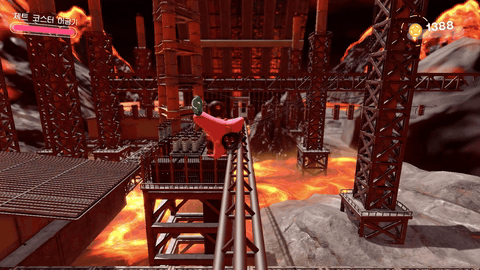<br/><sub><b>포탑 예측 발사</b> — 용암 롤러코스터 위 커비를 고정 포탑이 앞질러 겨냥</sub></td>
    <td width="50%">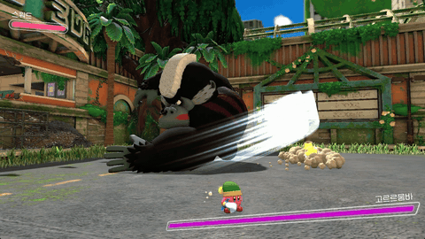<br/><sub><b>드랍 별</b> — 보스가 팔을 휘두르면 별이 호를 따라 퍼짐</sub></td>
  </tr>
  <tr>
    <td>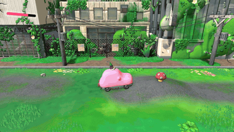<br/><sub><b>압착</b> — 자동차 커비에 치인 몬스터가 납작해지며 사라짐</sub></td>
    <td>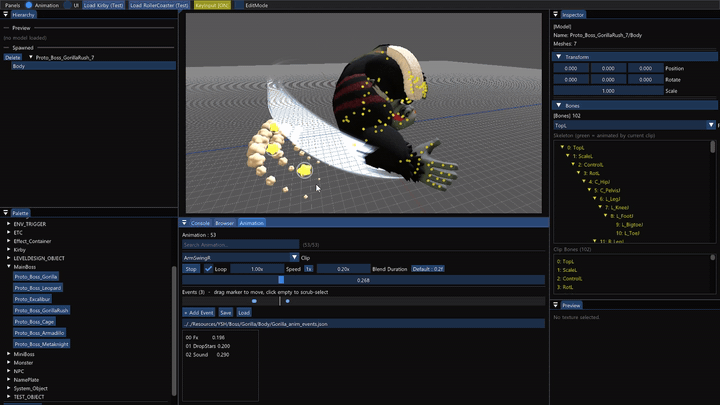<br/><sub><b>AnimUITool</b> — 애니메이션 이벤트로 넣은 별 배치 프리셋을<br/>툴에서 바로 확인</sub></td>
  </tr>
</table>

---

## 내 담당

대표 작업은 몬스터 AI 프레임워크 · Animator 확장 · 애니메이션 이벤트 저작 툴 AnimUITool입니다.

**몬스터 AI**
- 지각 · 판단 · 실행을 나눈 몬스터 AI 프레임워크와 공용 상태 16종
- 몬스터 16종 구현 (전용 판단 · 상태 14종, 공용 상태만 쓰는 2종)
- 몬스터 이동 · 레일 이동, 넉백 · 기절 · 압착 같은 피격 반응 상태

**애니메이션**
- Animator에 본 마스킹 · 재생 큐 · 오버레이 레이어 스택 증축
- 애니메이션 이벤트 저작 툴 AnimUITool (게임 객체 테스트 · 모델 확인 기능, 초기 UI 배치 모드 포함)

**원작 리소스 파이프라인 · 툴**
- 팀장의 초안 변환기를 바탕으로, 원작 `.bfres`를 엔진 포맷으로 바꾸는 변환 툴 AnimModelTool(C#)
- 텍스처 재베이크 · 폰트 · 사운드 판별 · 인코딩 검사 같은 보조 툴

**기믹 · 오브젝트**
- 포탑 예측 발사 · 낙하암 · 드랍 별 · 능력 방울 · 폭탄 탄도

**사운드 · 최적화 · 이펙트**
- 사운드 핸들 · BGM 페이드 · 환경음 재생, 몬스터 · 보스 사운드 배선
- 성능 개선을 위해 거리에 따라 몬스터 애니메이션 갱신 주기를 나누는 구조
- 개별 이펙트 30종 (피격 · 소멸 · 폭발 · 먼지 · 오라 등)

> 커비 조작 · 능력 복사 · 변신, 보스 AI 본체, 렌더링 · 엔진 코어, 맵 툴 · 레벨,<br/>
> 이펙트 시스템 코어는 팀원 작업입니다.

---

## 설계 및 구조

### 몬스터 AI

<p align="center">
  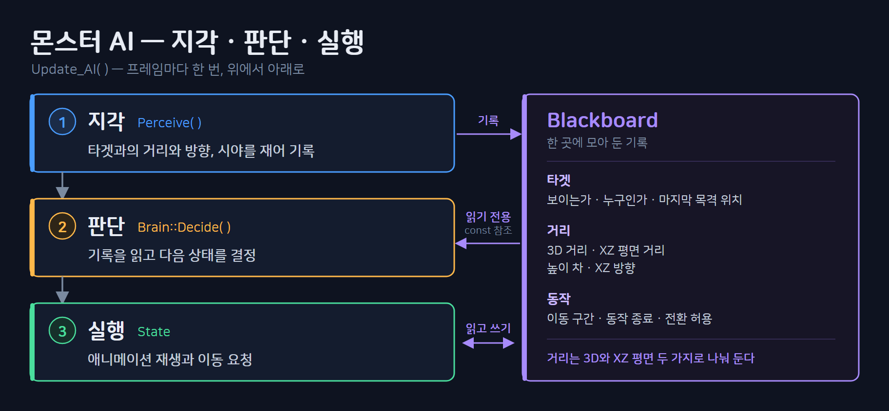
  <br/><sub>프레임마다 지각 → 판단 → 실행 순서로 한 번씩 진행하고, 판단은 블랙보드를 읽기만 함</sub>
</p>

| 계층 | 클래스 | 책임 |
| --- | --- | --- |
| 지각 | `MONSTER_BLACKBOARD` | 거리(3D · 수평 · 높이) · 시야 · 전이 가능 여부를<br/>프레임당 한 번 기록 |
| 판단 | `CMonsterBrain` → `CMonster_Brain_FSM` → 몬스터별 Brain | 블랙보드를 읽고 `Change_State`만 호출 |
| 실행 | `CMonster_StateMachine` + `CMonster_State` 파생 | Enter · Update · Exit, 애니메이션 재생과 이동 |
| 행동 | `CMonster_Movement` · `CMonster` 베이스 | 회전 · 이동 속도 · 피격 · 사망 공통 처리 |

### 원작 리소스 → 엔진

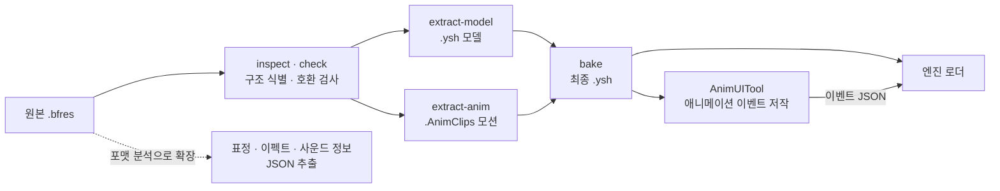

---

## 주요 구현

### 1. 몬스터 AI 프레임워크

몬스터 담당 1인이 14종 이상을 만들어야 했는데, 몬스터마다 다른 것은 "언제 무엇을 할지"라는 판단뿐이고<br/>
이동 · 피격 · 사망 · 흡입 같은 실행은 대부분 같았습니다.<br/>
그래서 **판단(Brain)과 실행(State)을 나누고 실행 상태를 공용화**했습니다.

<table>
  <tr>
    <td width="50%">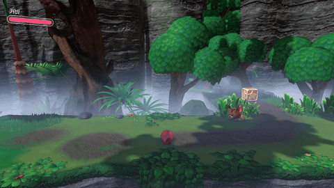<br/><sub><b>NormalEnemy 추격</b> — 커비를 발견하고 쫓아옴</sub></td>
    <td width="50%">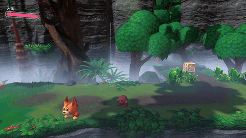<br/><sub><b>NormalEnemy 피격</b> — 공격 반대 방향으로 튕겨 날아감</sub></td>
  </tr>
  <tr>
    <td>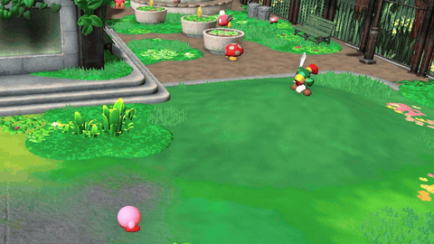<br/><sub><b>AI 변종 · 고정형</b> — BladeKnight가 자리를 지킨 채 커비 쪽으로 공격</sub></td>
    <td>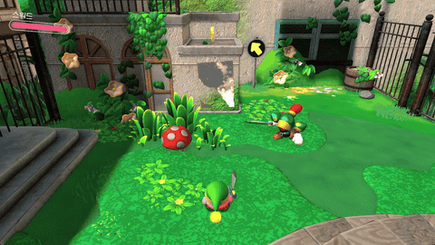<br/><sub><b>AI 변종 · 추격형</b> — 같은 BladeKnight가 커비를 쫓아가 공격</sub></td>
  </tr>
</table>

<details>
<summary><b>세부 구현 사항</b></summary>

**블랙보드**
- 지각 결과는 몬스터가 프레임당 한 번만 블랙보드에 기록하고, Brain은 읽기만 함
- 전환 가능 여부 같은 제어 값만 상태 머신이 상태를 바꿀 때 갱신
- 지각 계산은 상태 수와 무관하게 프레임당 한 번

<sub>코드 · [`CMonster::Perceive`](https://github.com/ddoichaboom/DX11_3D_GameProject_Team/blob/5cf52376ca5d1a02ebb6c31256e7fa08ef0c6b49/AAA/GameContent/Private/Monster.cpp#L504-L553) · [`MONSTER_BLACKBOARD`](https://github.com/ddoichaboom/DX11_3D_GameProject_Team/blob/5cf52376ca5d1a02ebb6c31256e7fa08ef0c6b49/AAA/GameContent/Public/Monster_BlackBoard.h#L48-L69)</sub>

**공용 상태**
- 이동 · 피격 · 사망 등 공용 상태 16종은 애니메이션 클립만 바꿔 여러 몬스터가 나눠 씀
- 몬스터는 필요한 상태만 등록
- 추격 · 순찰 · 후퇴는 이동 상태를 베이스로 함수만 오버라이드하는 템플릿 메서드 구조

<sub>코드 · [`CMonster_State_Move::Update`](https://github.com/ddoichaboom/DX11_3D_GameProject_Team/blob/5cf52376ca5d1a02ebb6c31256e7fa08ef0c6b49/AAA/GameContent/Private/Monster_State_Move.cpp#L27-L54) · [`CMonster_State_Chase`](https://github.com/ddoichaboom/DX11_3D_GameProject_Team/blob/5cf52376ca5d1a02ebb6c31256e7fa08ef0c6b49/AAA/GameContent/Private/Monster_State_Chase.cpp#L10-L18) · [`CMonster_State_Patrol`](https://github.com/ddoichaboom/DX11_3D_GameProject_Team/blob/5cf52376ca5d1a02ebb6c31256e7fa08ef0c6b49/AAA/GameContent/Private/Monster_State_Patrol.cpp#L42-L50)</sub>

**상태 교체**

<p align="center">
  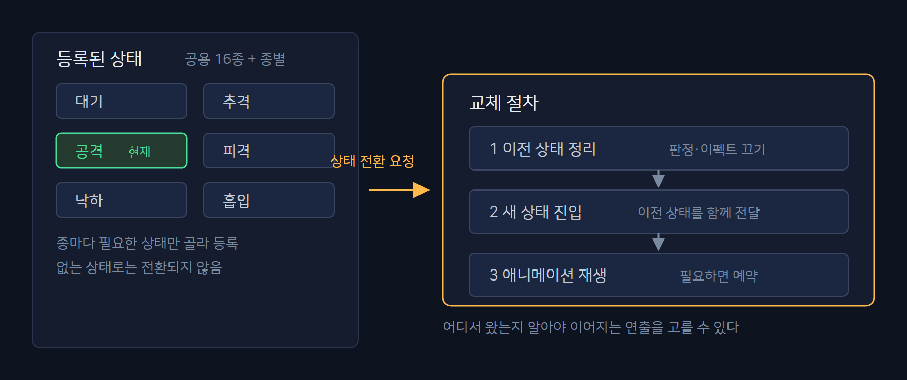
  <br/><sub>몬스터마다 등록한 상태 중에서 교체하며, 이전 상태 정리 → 이전 상태를 넘기며 새 상태 진입 → 애니메이션 재생 순서로 진행</sub>
</p>

- 몬스터에 등록된 상태로만 전환
- 이전 상태의 Exit에는 다음 상태를, 새 상태의 Enter에는 이전 상태를 넘겨<br/>
  어디서 왔는지에 따라 이어지는 연출을 고름
- 전환할 때 블랙보드의 전환 가능 여부를 새 상태의 끊김 허용 여부로 갱신하고,<br/>
  판단 쪽(`Can_Decide`)은 이 값과 경직 · 흡입 · 사망 상태를 한곳에서 확인

<sub>코드 · [`CMonster_StateMachine::Change_State`](https://github.com/ddoichaboom/DX11_3D_GameProject_Team/blob/5cf52376ca5d1a02ebb6c31256e7fa08ef0c6b49/AAA/GameContent/Private/Monster_StateMachine.cpp#L27-L58) · [`CMonster_Brain_FSM::Can_Decide`](https://github.com/ddoichaboom/DX11_3D_GameProject_Team/blob/5cf52376ca5d1a02ebb6c31256e7fa08ef0c6b49/AAA/GameContent/Private/Monster_Brain_FSM.cpp#L18-L34)</sub>

**AI 변종 (Variant)**
- 원작 배치 데이터의 변종 값(`Wait` · `WaitPursuit` 등)을 몬스터가 AIType으로 받아,<br/>
  같은 클래스 안에서 행동이 갈림
- BladeKnight 추격형은 수평 거리 2.5 안이면 공격하고, 밖이면 추격
- BladeKnight 고정형은 추격하지 않고 제자리에서 공격 · 공격 · 회오리 순서로 공격
- 공격 패턴은 Brain이 상태 배열을 순서대로 돌며 고름

<sub>코드 · [`CBladeKnight::Apply_AIVariation`](https://github.com/ddoichaboom/DX11_3D_GameProject_Team/blob/5cf52376ca5d1a02ebb6c31256e7fa08ef0c6b49/AAA/GameContent/Private/BladeKnight.cpp#L247-L252) · [`CBladeKnight_Brain::Decide_Internal`](https://github.com/ddoichaboom/DX11_3D_GameProject_Team/blob/5cf52376ca5d1a02ebb6c31256e7fa08ef0c6b49/AAA/GameContent/Private/BladeKnight_Brain.cpp#L17-L51) · [`Pick_AttackState`](https://github.com/ddoichaboom/DX11_3D_GameProject_Team/blob/5cf52376ca5d1a02ebb6c31256e7fa08ef0c6b49/AAA/GameContent/Private/BladeKnight_Brain.cpp#L66-L89)</sub>

**애니메이션 주도 이동**
- 이동은 애니메이션 이벤트의 이동 구간에서만 적용해, 공격 중 전진하는 구간을 애니메이션 쪽에서 조절

<sub>코드 · [`CMonster_State_Attack::Update`](https://github.com/ddoichaboom/DX11_3D_GameProject_Team/blob/5cf52376ca5d1a02ebb6c31256e7fa08ef0c6b49/AAA/GameContent/Private/Monster_State_Attack.cpp#L34-L60) · [`CMonster_Movement::Set_WindowMoveSpeed`](https://github.com/ddoichaboom/DX11_3D_GameProject_Team/blob/5cf52376ca5d1a02ebb6c31256e7fa08ef0c6b49/AAA/GameContent/Private/Monster_Movement.cpp#L65-L71)</sub>

</details>

<details>
<summary><b>설계 고민</b></summary>

**지각은 한 번만 계산하는 블랙보드**
- 상태들이 공통으로 필요한 정보는 플레이어와의 거리 · 시야 · 방향이었고,<br/>
  상태마다 따로 계산하면 같은 연산이 상태 수만큼 반복됨
- 그래서 몬스터 본체가 프레임당 한 번 기록하고 나머지는 읽기만 하도록 설계

**교체할 수 있게 분리한 판단부**
- 일반 몬스터는 FSM 판단으로 충분하지만, 보스 · 미니보스까지 만들게 될 가능성에 대비해<br/>
  판단부를 교체 가능한 Brain으로 분리
- 이 가정대로 팀원이 같은 Brain 베이스를 상속해<br/>
  Behavior Tree 방식 보스 AI(`CBoss_Brain : CMonsterBrain`)를 구현
- 커비의 상태 코드는 건드리지 않고 몬스터 AI를 따로 구현해, 플레이어 쪽에 회귀가 생기지 않게 함

**한 상태 = 한 행동**
- 상태 안에 단계 플래그를 두지 않고, 조건에 따라 갈리는 다단계 행동은 상태를 쪼갬
- 예: Kabu의 워프를 상태 하나 + 플래그로 만든 안 대신, 사라짐(WARPOUT) · 나타남(WARPIN) 두 상태로 분리
- 선딜 → 본타처럼 이어지는 클립은 상태를 나누지 않고 재생 큐로 연결

<sub>코드 · [`Kabu_State_WarpOut.cpp`](https://github.com/ddoichaboom/DX11_3D_GameProject_Team/blob/5cf52376ca5d1a02ebb6c31256e7fa08ef0c6b49/AAA/GameContent/Private/Kabu_State_WarpOut.cpp) · [`Kabu_State_WarpIn.cpp`](https://github.com/ddoichaboom/DX11_3D_GameProject_Team/blob/5cf52376ca5d1a02ebb6c31256e7fa08ef0c6b49/AAA/GameContent/Private/Kabu_State_WarpIn.cpp)</sub>

**원작 분석에서 출발한 결정**
- 같은 몬스터라도 배치마다 정해진 방식으로 다르게 움직이는 것을 보고,<br/>
  원작 배치 데이터에서 변종 값을 찾아 AI 변종으로 연결
- 원작은 공격 판정 · 전진 구간이 애니메이션 타이밍에 묶여 있어,<br/>
  이동 타이밍을 코드가 아니라 애니메이션 데이터로 맞춤

**구조의 대가**
- 몬스터 하나의 전체 동작을 보려면 Brain · 공용 상태 · 베이스 · 애니메이션 이벤트 4곳을 봐야 하고,<br/>
  팀원들에게 "번거롭다"는 피드백도 받음
- 1 ~ 2종이라면 상태 안에 판단까지 넣는 방식이 맞지만,<br/>
  14종 이상에 차량 압착 · 거리 컬링 · 사운드 같은 공통 기능을 전 몬스터에 적용해야 해 분리를 선택
- 그 결과 몬스터를 추가할 때 판단 코드와 전용 상태 몇 개만 만들면 되어,<br/>
  나흘 동안 6종(Dekabu · KoKabu · Bouncy · RabbitEnemy · Gigatzo · Noddy)을 추가
- 공용부를 고쳐도 몬스터별 코드를 다시 만질 일이 거의 없었고,<br/>
  실제로 생긴 누락은 새 공용 상태에 애니메이션 연결을 빠뜨린 경우(Kabu 해머 압착)였음

</details>

### 2. 이동 · 레일 이동

몬스터는 걷기 · 비행 · 레일 등 움직이는 방식이 제각각이라,<br/>
**상태는 이동 방향만 요청하고 실제 이동은 이동 컴포넌트가 맡게** 했습니다.

<table>
  <tr>
    <td width="50%">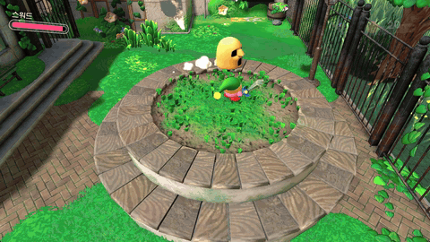<br/><sub><b>레일 이동</b> — Kabu가 원형 화단을 따라 돌며 진행 방향을 바라봄</sub></td>
    <td width="50%">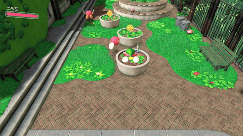<br/><sub><b>공중 레일</b> — BrontoBurt가 공중 경로를 따라 비행</sub></td>
  </tr>
</table>

<details>
<summary><b>세부 구현 사항</b></summary>

**이동 컴포넌트**
- 팀장이 만든 엔진 이동 컴포넌트(PhysX 캐릭터 컨트롤러 이동 · 중력 · 접지)를 상속해<br/>
  몬스터 전용 `CMonster_Movement`를 만들고, 상태는 이동 방향만 요청
- 바라보기(즉시 · 부드럽게 · 고정) · 애니메이션 이동 구간 속도 · 공중 띄우기 같은<br/>
  몬스터 전용 이동을 이 컴포넌트에 모음
- 엔진 이동 컴포넌트의 이동 함수 안에 있던 회전 코드를 별도 가상 함수(`Apply_Facing`)로 분리하고,<br/>
  몬스터 쪽에서 오버라이드해 공격 중 시선 고정 같은 조건을 추가

<sub>코드 · [`CMonster_Movement`](https://github.com/ddoichaboom/DX11_3D_GameProject_Team/blob/5cf52376ca5d1a02ebb6c31256e7fa08ef0c6b49/AAA/GameContent/Public/Monster_Movement.h#L8-L87) · [`CMovement::Apply_Facing`](https://github.com/ddoichaboom/DX11_3D_GameProject_Team/blob/5cf52376ca5d1a02ebb6c31256e7fa08ef0c6b49/AAA/Engine/Private/Movement.cpp#L74-L93) · [`CMonster_Movement::Apply_Facing`](https://github.com/ddoichaboom/DX11_3D_GameProject_Team/blob/5cf52376ca5d1a02ebb6c31256e7fa08ef0c6b49/AAA/GameContent/Private/Monster_Movement.cpp#L273-L279)</sub>

**레일 이동**
- 레일 몬스터는 `CMonster_Movement`를 상속한 `CMonster_RailMovement`로<br/>
  원작 배치 데이터의 레일 경로(직선 · 베지어 · 원)를 그대로 따라 이동
- 원작 데이터 구조에 맞춰 레일 이동 구조를 먼저 잡고, 임시 경로로 검증한 뒤 실제 배치 데이터로 전환
- 진행 거리를 누적해 해당 구간과 구간 비율을 찾고, 위치와 접선을 함께 계산
- 곡선에서도 접선 방향을 바라보고, 역주행할 때는 접선을 뒤집음

<sub>코드 · [`CMonster_RailMovement::Update_RailFollow`](https://github.com/ddoichaboom/DX11_3D_GameProject_Team/blob/5cf52376ca5d1a02ebb6c31256e7fa08ef0c6b49/AAA/GameContent/Private/Monster_RailMovement.cpp#L45-L103) · [`Eval_PathPos`](https://github.com/ddoichaboom/DX11_3D_GameProject_Team/blob/5cf52376ca5d1a02ebb6c31256e7fa08ef0c6b49/AAA/GameContent/Private/Monster_RailMovement.cpp#L244-L285) · [`Face_PathDir`](https://github.com/ddoichaboom/DX11_3D_GameProject_Team/blob/5cf52376ca5d1a02ebb6c31256e7fa08ef0c6b49/AAA/GameContent/Private/Monster_RailMovement.cpp#L287-L302)</sub>

</details>

<details>
<summary><b>설계 고민</b></summary>

**본 회전 대신 Transform 회전**
- Kabu가 구르며 도는 회전은 처음에 본 회전을 주입하는 방식이었음
- 이 방식은 매 프레임 넣어 줘야 해서 멈추면 애니메이션 포즈로 돌아가고,<br/>
  슬롯이 하나라 넉백 때의 기울기와 겹침
- 피격 순간의 회전각을 유지한 채 날아가는 연출이 안 되어, Transform 회전으로 바꿈

<sub>코드 · [Transform 회전](https://github.com/ddoichaboom/DX11_3D_GameProject_Team/blob/5cf52376ca5d1a02ebb6c31256e7fa08ef0c6b49/AAA/GameContent/Private/Monster_RailMovement.cpp#L53-L61)</sub>

**구간 길이 계산의 한계와 개선 설계**
- 현재는 구간 길이를 시작점과 끝점의 직선 거리로 계산해, 원 레일은 정확하지만<br/>
  베지어 구간에서는 이동 속도가 일정하지 않음
- 이동 컴포넌트가 경로 계산까지 떠안는 책임 문제도 있어, 경로를 별도 리소스 클래스(`CRailTrack`)로 떼고<br/>
  호 길이 표로 등속을 맞추는 구조를 설계
- 1단계(클래스 골격)만 적용하고, 다른 몬스터 구현을 우선해 나머지는 보류

<sub>코드 · [`Compute_PathLength`](https://github.com/ddoichaboom/DX11_3D_GameProject_Team/blob/5cf52376ca5d1a02ebb6c31256e7fa08ef0c6b49/AAA/GameContent/Private/Monster_RailMovement.cpp#L220-L242)</sub>

</details>

### 3. 피격 · 흡입 · 압착

팀장이 만든 커비 ↔ 몬스터 상호작용(피격 정보 · 흡입 · 뱉기)을 몬스터 공용 상태에 연결하고,<br/>
**넉백 · 기절 · 압착 같은 피격 반응을 공용 상태로 만들어** 모든 몬스터가 같은 방식으로 반응하게 했습니다.

<table>
  <tr>
    <td width="50%"><br/><sub><b>피격</b> — 공격 반대 방향으로 튕겨 날아감</sub></td>
    <td width="50%">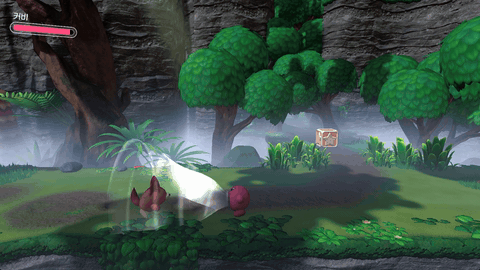<br/><sub><b>흡입</b> — 작아지며 커비 입 쪽으로 빨려 듦</sub></td>
  </tr>
  <tr>
    <td>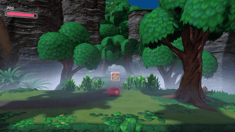<br/><sub><b>뱉기</b> — 머금었던 몬스터를 뱉어 공격</sub></td>
    <td><br/><sub><b>압착</b> — 자동차 커비에 치이면 납작해지며 사라짐</sub></td>
  </tr>
</table>

<details>
<summary><b>세부 구현 사항</b></summary>

**피격 반응**
- 넉백 · 기절 · 넉백 사망을 공용 상태로 만들고, 다시 맞으면 상태에 재진입해 타이머를 초기화
- 착지하거나 제한 시간이 지나면 대기 상태로 복귀
- 애니메이션 진행도에 맞춰 본을 절차적으로 회전해, 넉백 중에는 몸이 젖혀졌다 돌아오고<br/>
  기절해 날아갈 때는 한 바퀴 회전
- 공격 종류에 따라 피격음을 구분하고, 날아가는 동안 먼지 이펙트를 붙임

<sub>코드 · [`CMonster_State_KnockBack`](https://github.com/ddoichaboom/DX11_3D_GameProject_Team/blob/5cf52376ca5d1a02ebb6c31256e7fa08ef0c6b49/AAA/GameContent/Private/Monster_State_KnockBack.cpp#L20-L68) · [`CMonster_State_KnockOut::Update`](https://github.com/ddoichaboom/DX11_3D_GameProject_Team/blob/5cf52376ca5d1a02ebb6c31256e7fa08ef0c6b49/AAA/GameContent/Private/Monster_State_KnockOut.cpp#L28-L42) · [`CAnimator::SpinByProgress`](https://github.com/ddoichaboom/DX11_3D_GameProject_Team/blob/5cf52376ca5d1a02ebb6c31256e7fa08ef0c6b49/AAA/Engine/Private/Animator.cpp#L119-L131) · [`Resolve_DamageReactSFX`](https://github.com/ddoichaboom/DX11_3D_GameProject_Team/blob/5cf52376ca5d1a02ebb6c31256e7fa08ef0c6b49/AAA/GameContent/Private/Monster.cpp#L965-L984)</sub>

**흡입 · 뱉기**
- 흡입 상태에서는 컨트롤러 · 콜라이더를 끄고 진행 중이던 넉백 이동을 취소한 뒤,<br/>
  입 근처에 닿으면 삼킴 처리
- 뱉을 때의 회전 중심을 모델 경계 상자 중심 대신 몸 중심 뼈 위치로 잡도록 바꿈

<sub>코드 · [`CMonster_State_Captured::Enter`](https://github.com/ddoichaboom/DX11_3D_GameProject_Team/blob/5cf52376ca5d1a02ebb6c31256e7fa08ef0c6b49/AAA/GameContent/Private/Monster_State_Captured.cpp#L18-L35) · [`Update_SpatPivot_FromBone`](https://github.com/ddoichaboom/DX11_3D_GameProject_Team/blob/5cf52376ca5d1a02ebb6c31256e7fa08ef0c6b49/AAA/GameContent/Private/Monster.cpp#L944-L963)</sub>

**압착**
- 차량 · 해머 같은 짓누르는 공격을 지면에서 맞으면 납작해지며 사라짐 (Y 0.12배 · XZ 1.25배)
- 공중에서 맞으면 사망 이펙트와 함께 바로 사라짐

<sub>코드 · [`CMonster::On_Damaged`](https://github.com/ddoichaboom/DX11_3D_GameProject_Team/blob/5cf52376ca5d1a02ebb6c31256e7fa08ef0c6b49/AAA/GameContent/Private/Monster.cpp#L448-L466) · [`CMonster_State_Flatten::Enter`](https://github.com/ddoichaboom/DX11_3D_GameProject_Team/blob/5cf52376ca5d1a02ebb6c31256e7fa08ef0c6b49/AAA/GameContent/Private/Monster_State_Flatten.cpp#L20-L36)</sub>

</details>

<details>
<summary><b>설계 고민</b></summary>

**레일 몬스터의 압착 판정**
- "지면이면 압착, 공중이면 사망"으로 나누려 했는데, 레일 몬스터는 PhysX 컨트롤러를 거치지 않고<br/>
  위치를 직접 정해 접지 값이 항상 false라는 문제가 있었음
- 레일 이동에 접지 값을 따로 세팅하는 안은 몬스터 고유 판단이 이동 컴포넌트로 새어 나가고,<br/>
  레이캐스트로 지면을 찾는 안은 연출 분기에 비해 과하며,<br/>
  정적 플래그는 "지금 떠 있음" 같은 동적 조건을 표현할 수 없어 제외
- Kabu는 피격 처리를 오버라이드해, 레일 위 점과의 거리로 레일 위에 있는지 판단하고<br/>
  벗어나 있으면 바로 사라지게 처리

<sub>코드 · [`CKabu::Damaged`](https://github.com/ddoichaboom/DX11_3D_GameProject_Team/blob/5cf52376ca5d1a02ebb6c31256e7fa08ef0c6b49/AAA/GameContent/Private/Kabu.cpp#L65-L93) · [`Is_OffPath`](https://github.com/ddoichaboom/DX11_3D_GameProject_Team/blob/5cf52376ca5d1a02ebb6c31256e7fa08ef0c6b49/AAA/GameContent/Private/Monster_RailMovement.cpp#L105-L126)</sub>

</details>

> 피격 정보 구조체(`ATTACK_INFO`) · 흡입 인터페이스(`IInhalable`) · 흡입 이동 · 뱉기 발사체 · 넉백 발사 물리는<br/>
> 팀장이 만들었고, 이를 몬스터 공용 상태에 연결하고 넉백 · 기절 · 압착 반응을 구현했습니다.

### 4. Animator 레이어 · 마스킹

팀 초기 Animator는 클립 하나를 재생하는 골격이었습니다. 걸으면서 공격하거나 무기를 든 모습처럼<br/>
**부위마다 다른 클립을 재생**하기 위해 마스킹 · 재생 큐 · 레이어를 차례로 붙였습니다.

<table>
  <tr>
    <td width="50%">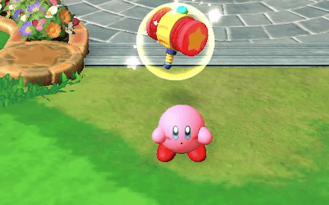<br/><sub><b>기본 대기</b> — 양팔을 흔드는 베이스 애니메이션</sub></td>
    <td width="50%">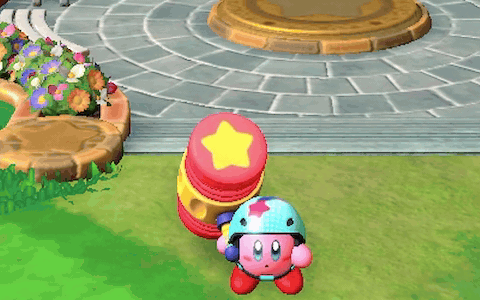<br/><sub><b>무기를 든 대기</b> — 해머를 든 팔의 본만 레이어로 덮어써,<br/>다른 팔은 기본 대기 동작 그대로</sub></td>
  </tr>
</table>

<details>
<summary><b>세부 구현 사항</b></summary>

**본 마스킹**
- 시작 본 이름만 주면 본 배열을 한 번 훑어 그 아래 전체를 마스크로 채움
- 시작 본을 여러 개 지정 가능

<sub>코드 · [`CModel::Build_MaskBones`](https://github.com/ddoichaboom/DX11_3D_GameProject_Team/blob/5cf52376ca5d1a02ebb6c31256e7fa08ef0c6b49/AAA/Engine/Private/Model.cpp#L428-L470)</sub>

**재생 큐**
- `Play`는 큐를 비우고 재생, `Enqueue`는 다음 클립을 예약
- 선딜 → 본타가 상태 코드 두 줄로 끝남

<sub>코드 · [`CAnimator::Enqueue`](https://github.com/ddoichaboom/DX11_3D_GameProject_Team/blob/5cf52376ca5d1a02ebb6c31256e7fa08ef0c6b49/AAA/Engine/Private/Animator.cpp#L288-L291) · [큐 소비 (CAnimator::Update)](https://github.com/ddoichaboom/DX11_3D_GameProject_Team/blob/5cf52376ca5d1a02ebb6c31256e7fa08ef0c6b49/AAA/Engine/Private/Animator.cpp#L439-L444)</sub>

**레이어 스택 (최대 4)**
- 0번은 베이스, 위 레이어는 클립을 샘플링해 마스크 본의 지역 행렬만 가중치만큼 덮어씀
- 레이어마다 클립 · 마스크 · 가중치 · 자체 시간을 따로 둬 서로 간섭 없이 각자 속도로 재생
- 같은 레이어에 다른 클립이 오면 이전 포즈와 교차 보간
- 샘플링은 레이어마다 하되, 부모부터 자식 순으로 행렬을 결합하는 계산은<br/>
  모든 레이어를 적용한 뒤 한 번만 수행

<sub>코드 · [`CAnimator::Apply_Overlay`](https://github.com/ddoichaboom/DX11_3D_GameProject_Team/blob/5cf52376ca5d1a02ebb6c31256e7fa08ef0c6b49/AAA/Engine/Private/Animator.cpp#L175-L244) · [`CModel::Apply_Mask`](https://github.com/ddoichaboom/DX11_3D_GameProject_Team/blob/5cf52376ca5d1a02ebb6c31256e7fa08ef0c6b49/AAA/Engine/Private/Model.cpp#L472-L576) · [`CModel::Update_Combined`](https://github.com/ddoichaboom/DX11_3D_GameProject_Team/blob/5cf52376ca5d1a02ebb6c31256e7fa08ef0c6b49/AAA/Engine/Private/Model.cpp#L592-L596)</sub>

**팀원 사용**
- 커비 소드 오버레이 등 팀원 코드가 이 API를 사용

```cpp
// Anim_Layer.h : 레이어 하나가 가진 상태 (요약)
struct LAYER
{
    _string         strClip;                    // 재생 중 클립 ("" = 비활성)
    _float          fLocalTime = { 0.f };       // 레이어 자체 시간
    _float          fClipBlend = { 0.f };       // 클립 교차 보간
    _int            iPrevAnimIndex = { -1 };    // 이전 클립 상태 보존
    _float          fWeight = { 0.f };          // 가중치 페이드 인 / 아웃
    _float          fSpeed = { 1.f };           // 레이어별 재생 제어
    _bool           bLoop = { true };
    _bool           bPaused = { false };
    vector<_uint>   MaskBones;                  // 마스크 본 인덱스
    // ...
};
```

<sub>코드 · [`LAYER`](https://github.com/ddoichaboom/DX11_3D_GameProject_Team/blob/5cf52376ca5d1a02ebb6c31256e7fa08ef0c6b49/AAA/Engine/Public/Anim_Layer.h#L8-L34)</sub>

</details>

<details>
<summary><b>설계 고민</b></summary>

**마스킹을 넣은 계기**
- 커비 담당자가 "특정 상태에서 일부 본에는 다른 애니메이션이 적용된 것 같다"는 관찰을<br/>
  전해 와, 원작을 확인한 뒤 도입
- 도입 이틀 뒤 커비 소드 오버레이에서 처음 사용

**베이스는 두고 오버레이만 Animator로**
- 재생 전체를 Animator로 옮기는 것이 맞다고 봤지만, 이미 개발이 많이 진행된 상태라 베이스 재생은<br/>
  기존 모델에 남기고 1번 레이어부터만 Animator가 맡도록 절충

**레이어 자체 시간으로 샘플링**
- 레이어는 공유 애니메이션 객체의 재생 위치를 움직이지 않고 자기 시간으로 샘플링해,<br/>
  여러 레이어가 같은 클립을 써도 간섭하지 않음
- 베이스 경로에서는 같은 클립을 두 곳에서 쓰면 프레임당 두 번 진행되는 2배속 버그가 실제로 있었음

**한 번에 전환하되 API는 유지**
- 개발 속도를 위해 점진적으로 옮기는 대신 레이어 구조로 한 번에 전환하고, 회귀 체크리스트로 확인
- 기존 API는 유지해 팀원 코드가 깨지지 않게 함

</details>

> Animator 골격과 애니메이션 이벤트 발화 구조는 팀장이 만들었고,<br/>
> 그 위의 마스킹 · 재생 큐 · 레이어를 설계 · 구현했습니다.

### 5. 원작 리소스 파이프라인 (AnimModelTool)

원작 `.bfres`를 교환 포맷(fbx 등)으로 거치면 여러 장의 머티리얼 텍스처가 한 장으로 뭉개지고<br/>
대량 변환도 어려워서, 팀은 **파싱 라이브러리(BfresLibrary)로 엔진 포맷에 바로 변환**하는 방향을 택했습니다.<br/>
팀장이 만든 초안 변환기를 바탕으로,<br/>
검사 · 분리 추출 · 베이크와 포맷 분석까지 담은 **11개 명령의 C# 툴 AnimModelTool**을 만들었습니다.

<details>
<summary><b>세부 구현 사항</b></summary>

**검사 먼저**
- `inspect`(구조 식별) · `check`(모델 ↔ 모션 호환성 3분류)로 변환 전에 문제를 확인

**모델 · 모션 분리**
- 모델은 `.ysh`, 모션은 여러 클립을 묶은 `.AnimClips`로 따로 추출
- 둘은 **본 이름**으로 연결 (BFRES에는 모델 ↔ 모션 대응표가 없음)
- 추출한 모션을 모델과 합쳐 최종 `.ysh`로 베이크하고,<br/>
  AnimUITool은 이 `.ysh`를 불러와 애니메이션 이벤트만 별도 JSON으로 저작

**포맷 분석으로 확장**
- 텍스처 패턴 애니메이션(표정), `.ptcl`(이펙트 컨테이너), 사운드 정보까지 JSON으로 추출
- 원작 텍스처(BNTX)를 원래 포맷 그대로 `.dds`로 직추출하고, 기존 재베이크 결과와 바이트 단위로 비교해<br/>
  18개 모두 일치하는 것을 확인

**결과 · 운영**
- 몬스터 · 보스 모델과 모션 전량, 이펙트 텍스처 3,773장 · 메시 929개 일괄 변환
- 배치 메뉴(`Export_From_Import.bat`)와 단독 실행 배포로,<br/>
  `Import` 폴더에 넣고 실행하면 되는 팀 공용 툴로 운영

```
inspect · check · extract-model · extract-anim · extract-animinfo · ptcl-inspect · ptcl-extract
extract-soundinfo · bake · bake-ysh · probe-rm
```

</details>

<details>
<summary><b>설계 고민</b></summary>

**초안을 고치지 않고 별도 툴로**
- 초안 변환기는 팀장이 계속 손볼 수 있는 코드였고,<br/>
  기능을 계속 붙여 나갈 툴은 직접 관리하는 편이 낫다고 판단해 별도 툴로 분리

**검사를 먼저 둔 이유**
- 매번 추출한 뒤 결과를 눈으로 확인하는 반복이 벅차서, 변환 전에 구조와 호환성을 확인하도록 단계를 나눔

**표정 데이터를 찾은 경위**
- 표정이 필요해졌을 때, 원작 애니메이션이 스켈레탈 · 텍스처 · 셰이더 계열로 나뉜 것을 보고<br/>
  텍스처 패턴 애니메이션을 분석해 표정 이벤트로 추출

</details>

> 직접 변환 방향과 초안 변환기(BFRES_Converter) · `.ysh` 포맷은 팀장 작업이고,<br/>
> 그 위의 파이프라인 · 포맷 분석 · 배치 운영을 맡았습니다.

### 6. 애니메이션 이벤트 저작 툴 (AnimUITool)

공격 판정 · 이펙트 · 사운드 · 이동 구간을 코드에 시간으로 적지 않도록,<br/>
**애니메이션 타임라인 위에서 이벤트를 배치하고 바로 재생해 보는 툴**을 만들었습니다.<br/>
게임 객체를 툴 안에 바로 생성해 확인할 수 있게 하고, 클립 검색 · 본 · 메시 · 셰이더 확인처럼 작업하면서<br/>
필요했던 기능을 계속 붙였습니다.

<table>
  <tr>
    <td width="50%">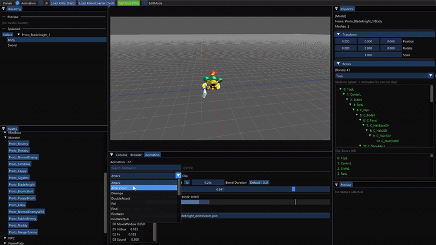<br/><sub><b>이벤트 타임라인</b> — 이벤트를 타임라인에 놓고 재생해 바로 확인</sub></td>
    <td width="50%">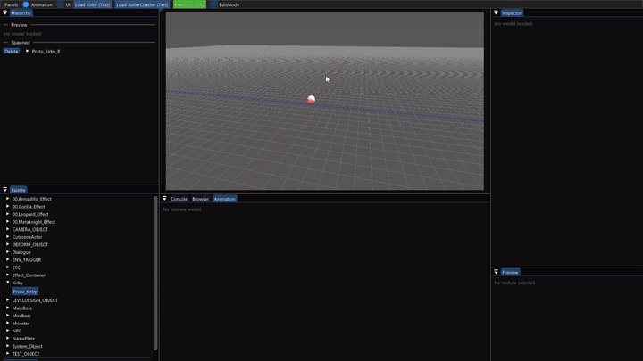<br/><sub><b>배치 · 상호작용</b> — 툴 안에 커비와 몬스터를 배치하고 직접 조작</sub></td>
  </tr>
</table>

<details>
<summary><b>세부 구현 사항</b></summary>

**게임과 같은 환경**
- 런처와 같은 Engine · GameContent 위에 실행 파일만 따로 둬,<br/>
  게임과 같은 경로로 리소스를 올리고 같은 객체를 확인
- 브라우저 패널에서 폴더를 탐색하고, 모델 파일을 더블클릭해 바로 미리보기

<sub>코드 · [`CPanel_Browser`](https://github.com/ddoichaboom/DX11_3D_GameProject_Team/blob/5cf52376ca5d1a02ebb6c31256e7fa08ef0c6b49/AAA/AnimUITool/Private/Panel_Browser.cpp#L112-L153)</sub>

**게임 객체 바로 테스트**
- 프레임워크의 오브젝트 팩토리 목록을 분류별 팔레트로 보여 주고,<br/>
  누르면 그 오브젝트의 리소스만 불러와 생성 (레벨 전체를 띄우지 않고 몬스터 하나만 확인)
- 생성한 객체는 계층 패널에 트리로 표시하고, 몸체 · 모자 같은 파츠를 고르면 그 파츠의 Animator에 연결해<br/>
  실제 게임 객체 위에서 이벤트 저작
- Animator가 없는 파츠는 회색으로 표시하고, Delete 키로 삭제하면 선택도 함께 정리
- 300 × 300 크기의 정적 충돌 바닥을 깔아, 생성한 객체가 떨어지지 않고 서 있게 함

<sub>코드 · [`CPanel_Palette`](https://github.com/ddoichaboom/DX11_3D_GameProject_Team/blob/5cf52376ca5d1a02ebb6c31256e7fa08ef0c6b49/AAA/AnimUITool/Private/Panel_Palette.cpp#L13-L55) · [`CLevel_Tool::Spawn_Object`](https://github.com/ddoichaboom/DX11_3D_GameProject_Team/blob/5cf52376ca5d1a02ebb6c31256e7fa08ef0c6b49/AAA/AnimUITool/Private/Level_Tool.cpp#L1243-L1270) · [`Render_AnimationHierarchy`](https://github.com/ddoichaboom/DX11_3D_GameProject_Team/blob/5cf52376ca5d1a02ebb6c31256e7fa08ef0c6b49/AAA/AnimUITool/Private/Panel_Hierarchy.cpp#L36-L209) · [`Bind_ForAnimSource`](https://github.com/ddoichaboom/DX11_3D_GameProject_Team/blob/5cf52376ca5d1a02ebb6c31256e7fa08ef0c6b49/AAA/AnimUITool/Private/Panel_Manager.cpp#L324-L352) · [`Ready_TestGround`](https://github.com/ddoichaboom/DX11_3D_GameProject_Team/blob/5cf52376ca5d1a02ebb6c31256e7fa08ef0c6b49/AAA/AnimUITool/Private/Level_Tool.cpp#L148-L189)</sub>

**이벤트 타임라인**
- 클립 길이와 무관하게 0 ~ 1로 정규화한 하나의 타임라인 사용
- 이벤트는 점, 구간 이벤트는 시작 · 끝을 따로 조절
- 이벤트는 타입별로 정수 · 문자열 값을 전달<br/>
  (예: 드랍 별 프리셋 이름을 문자열로 넣으면 툴과 게임 모두 적용)
- 마커 띠에서는 클릭한 곳에서 8px 안의 가장 가까운 마커를 고르고, 실제로 끌 때만 옮김
- 마커가 겹쳐도 고를 수 있게 옆에 이벤트 목록(번호 · 종류 · 위치)을 두고, 고른 이벤트를 바로 편집
- 커비 표정 이벤트(몸 · 입 · 눈)는 숫자 대신 상태 이름 드롭다운으로 입력
- 저장할 때 이벤트를 진행도 순으로 정렬하고,<br/>
  이벤트 파일 경로는 모델 경로에서 `<모델명>_anim_events.json`으로 자동 지정

<sub>코드 · [`CPanel_Animation::Render_EventTimeline`](https://github.com/ddoichaboom/DX11_3D_GameProject_Team/blob/5cf52376ca5d1a02ebb6c31256e7fa08ef0c6b49/AAA/AnimUITool/Private/Panel_Animation.cpp#L202-L390)</sub>

**재생 확인**
- 클립이 많은 모델은 이름 검색(대소문자 무시, 이름순 정렬)으로 찾고, 긴 목록은 화면에 보이는 행만 그림
- Space로 재생 · 정지를 바꾸고, 정지 중에는 타임라인을 끌어 원하는 시점을 확인
- 재생 속도 · 블렌드 시간을 바꿔 보며 상태 코드에 넣을 값을 찾고,<br/>
  버튼 하나로 기본값(1배속 · 0.2초)으로 되돌림

<sub>코드 · [`CPanel_Animation::Render`](https://github.com/ddoichaboom/DX11_3D_GameProject_Team/blob/5cf52376ca5d1a02ebb6c31256e7fa08ef0c6b49/AAA/AnimUITool/Private/Panel_Animation.cpp#L43-L190) · [`Rebuild_AnimFilter`](https://github.com/ddoichaboom/DX11_3D_GameProject_Team/blob/5cf52376ca5d1a02ebb6c31256e7fa08ef0c6b49/AAA/AnimUITool/Private/Panel_Animation.cpp#L418-L440)</sub>

**모델 · 렌더 확인**
- 본 트리에서 현재 클립이 움직이는 본을 초록색으로 표시하고,<br/>
  고른 본은 뷰포트에 빨간 점으로 강조 (본 위치를 화면 좌표로 투영)
- 메시마다 켜고 끄거나 하나만 보기(Solo), 전체 켜기 · 끄기로 겹친 메시(표정 · 무기 등)를 확인
- 셰이더 · 패스를 강제로 바꿔 보고 실제로 적용된 셰이더 · 패스를 표시해, 머티리얼 문제와 모델 문제를 구분
- 커비 프리뷰는 몸 · 입 · 눈 상태를 드롭다운으로 바꿔 표정 메시 · 텍스처 전환을 확인
- 브라우저에서 고른 png · dds 텍스처를 미리보기 패널에 크기와 함께 표시

<sub>코드 · [`Render_Bones`](https://github.com/ddoichaboom/DX11_3D_GameProject_Team/blob/5cf52376ca5d1a02ebb6c31256e7fa08ef0c6b49/AAA/AnimUITool/Private/Panel_Inspector.cpp#L444-L551) · [`CPanel_Viewport::Render`](https://github.com/ddoichaboom/DX11_3D_GameProject_Team/blob/5cf52376ca5d1a02ebb6c31256e7fa08ef0c6b49/AAA/AnimUITool/Private/Panel_Viewport.cpp#L17-L90) · [`Render_Meshs`](https://github.com/ddoichaboom/DX11_3D_GameProject_Team/blob/5cf52376ca5d1a02ebb6c31256e7fa08ef0c6b49/AAA/AnimUITool/Private/Panel_Inspector.cpp#L553-L636) · [`Render_RenderDebug`](https://github.com/ddoichaboom/DX11_3D_GameProject_Team/blob/5cf52376ca5d1a02ebb6c31256e7fa08ef0c6b49/AAA/AnimUITool/Private/Panel_Inspector.cpp#L202-L244) · [`Render_KirbyFace`](https://github.com/ddoichaboom/DX11_3D_GameProject_Team/blob/5cf52376ca5d1a02ebb6c31256e7fa08ef0c6b49/AAA/AnimUITool/Private/Panel_Inspector.cpp#L638-L680) · [`CPanel_Preview`](https://github.com/ddoichaboom/DX11_3D_GameProject_Team/blob/5cf52376ca5d1a02ebb6c31256e7fa08ef0c6b49/AAA/AnimUITool/Private/Panel_Preview.cpp)</sub>

**작업 환경**
- 상단 메뉴에서 패널을 켜고 끄고, 애니메이션 · UI 작업 모드를 바꾸면 그 모드에 필요한 패널만 표시
- 오른쪽 마우스 버튼을 누른 채 WASD · QE로 움직이는 편집 카메라와 바닥 그리드
- 콘솔은 로그 수준별로 켜고 끌 수 있고, 맨 아래를 보고 있을 때만 자동 스크롤

<sub>코드 · [`Render_ModeBar`](https://github.com/ddoichaboom/DX11_3D_GameProject_Team/blob/5cf52376ca5d1a02ebb6c31256e7fa08ef0c6b49/AAA/AnimUITool/Private/Panel_Manager.cpp#L405-L427) · [`Is_PanelAllowedInCurrentMode`](https://github.com/ddoichaboom/DX11_3D_GameProject_Team/blob/5cf52376ca5d1a02ebb6c31256e7fa08ef0c6b49/AAA/AnimUITool/Private/Panel_Manager.cpp#L487-L512) · [`CEditCamera`](https://github.com/ddoichaboom/DX11_3D_GameProject_Team/blob/5cf52376ca5d1a02ebb6c31256e7fa08ef0c6b49/AAA/AnimUITool/Private/EditCamera.cpp#L25-L69) · [`CPanel_Console`](https://github.com/ddoichaboom/DX11_3D_GameProject_Team/blob/5cf52376ca5d1a02ebb6c31256e7fa08ef0c6b49/AAA/AnimUITool/Private/Panel_Console.cpp#L12-L57)</sub>

**툴 ↔ 게임**
- 이벤트는 JSON으로 저장하고 게임이 같은 파일을 읽음
- 툴에서 맞춘 타이밍이 게임에서도 그대로 동작

<sub>코드 · [`CAnimator::Save_ToFile`](https://github.com/ddoichaboom/DX11_3D_GameProject_Team/blob/5cf52376ca5d1a02ebb6c31256e7fa08ef0c6b49/AAA/Engine/Private/Animator.cpp#L605-L621) · [`CAnimator::Load_FromFile`](https://github.com/ddoichaboom/DX11_3D_GameProject_Team/blob/5cf52376ca5d1a02ebb6c31256e7fa08ef0c6b49/AAA/Engine/Private/Animator.cpp#L585-L603)</sub>

**UI 배치 모드 (초기)**
- 프로젝트 초반(06-03 ~ 06-12) UI를 함께 맡았을 때 같은 툴에 UI 배치 모드를 만듦
- 설계 해상도 기준 캔버스에서 맨 위 UI 파트를 클릭해 고르고, 끌어서 옮기거나 네 모서리 핸들로 크기 조절
- 이미지 · 스프라이트 애니메이션 · 텍스트 · 이펙트 · 게이지 파트를 추가하고,<br/>
  컨테이너 · 매니페스트 JSON으로 저장 · 불러오기
- 브라우저의 png · dds를 캔버스에 끌어다 놓으면 마우스 위치에 이미지 · 스프라이트 파트가 생기고,<br/>
  UI JSON을 놓으면 그 UI를 불러옴
- 스프라이트 애니메이션은 프레임 · 진행도를 직접 움직여 보고,<br/>
  UI 이펙트 셰이더는 진행도 · 마스크 채널 · 반전을 바로 조절

<sub>코드 · [`Pick_TopmostPart`](https://github.com/ddoichaboom/DX11_3D_GameProject_Team/blob/5cf52376ca5d1a02ebb6c31256e7fa08ef0c6b49/AAA/AnimUITool/Private/Panel_UICanvas.cpp#L731-L804) · [`Hit_SelectedHandle`](https://github.com/ddoichaboom/DX11_3D_GameProject_Team/blob/5cf52376ca5d1a02ebb6c31256e7fa08ef0c6b49/AAA/AnimUITool/Private/Panel_UICanvas.cpp#L806-L847) · [`Update_Drag`](https://github.com/ddoichaboom/DX11_3D_GameProject_Team/blob/5cf52376ca5d1a02ebb6c31256e7fa08ef0c6b49/AAA/AnimUITool/Private/Panel_UICanvas.cpp#L890-L990) · [캔버스 드롭](https://github.com/ddoichaboom/DX11_3D_GameProject_Team/blob/5cf52376ca5d1a02ebb6c31256e7fa08ef0c6b49/AAA/AnimUITool/Private/Panel_UICanvas.cpp#L240-L288) · [`Save_UIManifest`](https://github.com/ddoichaboom/DX11_3D_GameProject_Team/blob/5cf52376ca5d1a02ebb6c31256e7fa08ef0c6b49/AAA/AnimUITool/Private/Level_Tool.cpp#L933-L991) · [`Render_SpriteAnimControl`](https://github.com/ddoichaboom/DX11_3D_GameProject_Team/blob/5cf52376ca5d1a02ebb6c31256e7fa08ef0c6b49/AAA/AnimUITool/Private/Panel_Inspector.cpp#L1176-L1224) · [`Render_EffectInspector`](https://github.com/ddoichaboom/DX11_3D_GameProject_Team/blob/5cf52376ca5d1a02ebb6c31256e7fa08ef0c6b49/AAA/AnimUITool/Private/Panel_Inspector.cpp#L1002-L1175)</sub>

</details>

<details>
<summary><b>설계 고민</b></summary>

**편집 상태는 한곳에**
- 패널마다 상태를 따로 들고 있으면 서로 어긋나서, 패널 매니저가 편집 컨텍스트 하나를 갖고<br/>
  패널은 보여 주기만 하도록 구성

<sub>코드 · [`ANIM_CONTEXT`](https://github.com/ddoichaboom/DX11_3D_GameProject_Team/blob/5cf52376ca5d1a02ebb6c31256e7fa08ef0c6b49/AAA/AnimUITool/Public/AnimUITool_Struct.h#L21-L42)</sub>

**Animator를 거쳐 재생**
- 모델을 직접 재생하면 애니메이션 이벤트가 발화하지 않아, 게임과 같은 Animator 경로로 재생
- 저작하는 동안에도 판정 · 이펙트 · 사운드 이벤트가 게임과 똑같이 동작

<sub>코드 · [`CPreview_Actor::Update`](https://github.com/ddoichaboom/DX11_3D_GameProject_Team/blob/5cf52376ca5d1a02ebb6c31256e7fa08ef0c6b49/AAA/AnimUITool/Private/Preview_Actor.cpp#L42-L46)</sub>

**쓰면서 불편한 점을 바로 고침**
- 마커가 겹치면 타임라인에서 고르기 어렵고, 클릭만 해도 마커가 커서 위치로 옮겨지던 동작이 저작을 방해함
- 실제로 끌 때만 옮기도록 바꾸고, 타임라인 없이 고를 수 있는 이벤트 목록을 추가
- 시작 위치는 슬라이더 대신 0.001 단위로 끌어 조절하는 입력으로 바꿔 미세 조정

<sub>커밋 · [`b625332a` AnimUITool Fix (AnimEvent 제작 용이)](https://github.com/ddoichaboom/DX11_3D_GameProject_Team/commit/b625332a)</sub>

</details>

> 오브젝트 팩토리와 키 입력 토글, UI를 넘긴 뒤 추가된 코디네이터 · 커튼 계열 UI 파트는 팀장 작업이고,<br/>
> 롤러코스터 프리뷰는 팀원 작업입니다.

### 7. 포탑 예측 발사 · 낙하암

롤러코스터 구간의 고정 포탑과 화산 구간의 낙하암을 만들었습니다.<br/>
포탑은 포신이 고정되어 있어 **조준 대신 발사 시점을 계산**합니다.

<table>
  <tr>
    <td width="50%"><br/><sub><b>고정 포탑</b> — 롤러코스터로 지나가는 커비를 예측 발사</sub></td>
    <td width="50%">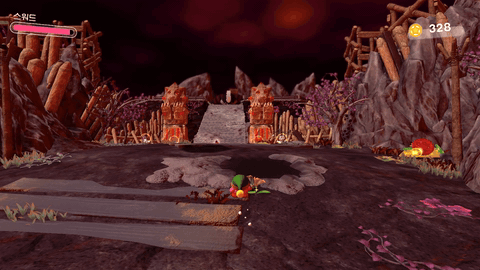<br/><sub><b>낙하암</b> — 화염을 끌며 떨어져 목표 지점에서 폭발</sub></td>
  </tr>
</table>

<details>
<summary><b>세부 구현 사항</b></summary>

**고정 포탑 (Gigatzo)**

<p align="center">
  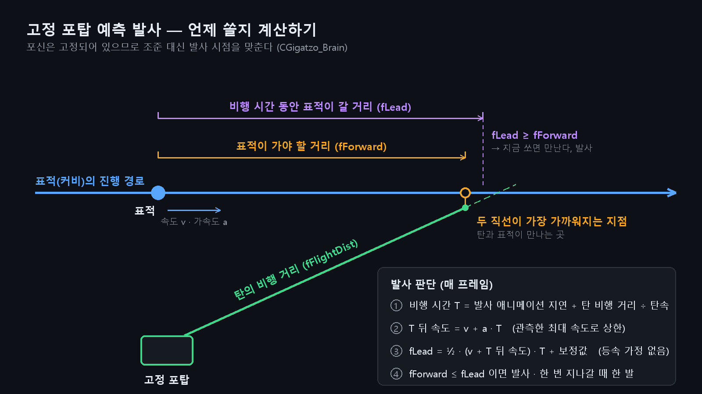
  <br/><sub>탄이 날아가는 동안 표적이 갈 거리(fLead)가 표적이 최근접점까지 가야 할 거리(fForward)보다 길어지는 순간 발사</sub>
</p>

- 넓은 감지 범위로 표적 위치를 기록해 프레임 간 위치 차로 속도, 속도 변화로 가속도를 구함
- 표적 진행 경로와 포신 방향 직선의 최근접점으로 탄의 비행 거리를 구하고,<br/>
  비행 시간 동안 표적이 갈 거리(가속 반영)만큼 앞을 노려 발사
- 표적이 한 번 지나갈 때 한 발만 쏘고, 지나간 뒤 일정 거리를 벗어나면 다시 장전

**낙하암 (Meteor)**
- 공중 시작점과 지면 목표점 두 좌표만 받아 그 사이를 내려오고, 목표를 지나치지 않게 멈춘 뒤 폭발
- 감지 콜라이더 · 트리거 박스로 플레이어를 감지하거나 특정 이벤트와 연결해 다양한 조건에서 낙하

<sub>코드 · [`CLD_MeteorGenerator::Update`](https://github.com/ddoichaboom/DX11_3D_GameProject_Team/blob/5cf52376ca5d1a02ebb6c31256e7fa08ef0c6b49/AAA/GameContent/Private/LD_MeteorGenerator.cpp#L44-L77) · [`Build_Desc`](https://github.com/ddoichaboom/DX11_3D_GameProject_Team/blob/5cf52376ca5d1a02ebb6c31256e7fa08ef0c6b49/AAA/GameContent/Private/LD_MeteorGenerator.cpp#L191-L223) · [`CMeteorRock::Update`](https://github.com/ddoichaboom/DX11_3D_GameProject_Team/blob/5cf52376ca5d1a02ebb6c31256e7fa08ef0c6b49/AAA/GameContent/Private/MeteorRock.cpp#L93-L163)</sub>

```cpp
// CGigatzo_Brain : 표적 경로 L1(t)와 포신 직선 L2(s)의 최근접점 (요약)
const _vector vR = vTargetPos - vMuzzlePos;
const _float fB = XMVectorGetX(XMVector3Dot(vForward, vMuzzleDir));
const _float fD = XMVectorGetX(XMVector3Dot(vForward, vR));
const _float fE = XMVectorGetX(XMVector3Dot(vMuzzleDir, vR));
const _float fDenom = 1.f - fB * fB;                 // 두 방향이 평행하면 0
const _float fForward    = (fB * fE - fD) / fDenom;  // 표적이 최근접점까지 가야 할 거리
const _float fFlightDist = (fE - fB * fD) / fDenom;  // 탄의 비행 거리

const _float fT = s_fAnimDelay + fFlightDist / fBulletSpeed;
_float fEndSpeed = fTargetSpeed + m_fTargetAccel * fT;               // 등속 가정 없이 가속 반영
// ... 관측한 최대 속도로 상한
const _float fLead = 0.5f * (fTargetSpeed + fEndSpeed) * fT + s_fLeadBias;
```

<sub>코드 · [`CGigatzo_Brain::Decide`](https://github.com/ddoichaboom/DX11_3D_GameProject_Team/blob/5cf52376ca5d1a02ebb6c31256e7fa08ef0c6b49/AAA/GameContent/Private/Gigatzo_Brain.cpp#L16-L173)</sub>

</details>

<details>
<summary><b>설계 고민</b></summary>

**원작 데이터를 그대로 읽는 낙하암**
- 원작 맵 데이터를 분석해 낙하 시작점 · 착지점 · 시작 조건(플레이어 감지 / 이벤트 수신) · 반복 여부가<br/>
  배치마다 들어 있는 것을 확인
- 이 값을 그대로 읽는 구조로 설계해, 배치마다 다른 낙하 방식을 코드 수정 없이 재현

</details>

### 8. 드랍 별 · 능력 방울

보스전에서 떨어지는 별과 능력을 담은 방울을 **흡입할 수 있는 오브젝트**로 만들고,<br/>
둘 다 오브젝트 풀에서 꺼내 씁니다.

<table>
  <tr>
    <td width="50%"><br/><sub><b>SWEEP</b> — 팔을 휘두른 방향의 호를 따라 별이 나옴</sub></td>
    <td width="50%">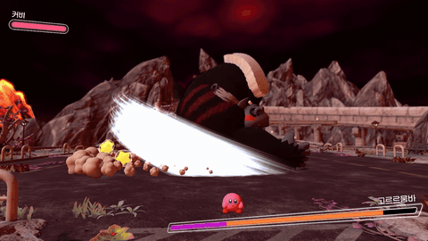<br/><sub><b>별 흡입 · 뱉기</b> — 보스가 뿌린 별을 흡입해 뱉으면<br/>보스를 맞히는 공격이 됨</sub></td>
  </tr>
  <tr>
    <td colspan="2" align="center">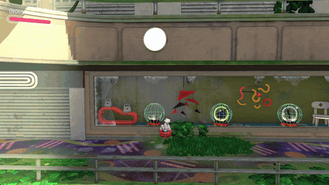<br/><sub><b>능력 방울</b> — 능력을 버리면 방울이 포물선을 그리며 날아가 떠다님</sub></td>
  </tr>
</table>

<details>
<summary><b>세부 구현 사항</b></summary>

**드랍 별**
- 보스 패턴에서 떨어지는 별을 흡입 전용 오브젝트로 만들고,<br/>
  전투 중 생성 · 삭제를 줄이기 위해 오브젝트 풀에서 꺼내 씀
- 배치 방식은 SWEEP(시전자 방향 기준 시작 각도부터 호를 따라)과 CIRCLE(원 안 면적에 고르게) 두 가지
- CIRCLE은 반지름을 난수의 제곱근에 비례하게 뽑아, 별이 가운데로 몰리지 않고 면적 전체에 고르게 퍼짐
- 배치 프리셋을 보스 애니메이션 이벤트에 이름으로 지정
- 일정 시간이 지나면 콜라이더 · 컨트롤러를 끄고 풀로 반환

<sub>코드 · [`CDropStar_Manager::Spawn_Pattern`](https://github.com/ddoichaboom/DX11_3D_GameProject_Team/blob/5cf52376ca5d1a02ebb6c31256e7fa08ef0c6b49/AAA/GameContent/Private/DropStar_Manager.cpp#L75-L119) · [`Compute_StarPos`](https://github.com/ddoichaboom/DX11_3D_GameProject_Team/blob/5cf52376ca5d1a02ebb6c31256e7fa08ef0c6b49/AAA/GameContent/Private/DropStar_Manager.cpp#L380-L407) · [`Name_To_Preset`](https://github.com/ddoichaboom/DX11_3D_GameProject_Team/blob/5cf52376ca5d1a02ebb6c31256e7fa08ef0c6b49/AAA/GameContent/Private/DropStar_Manager.cpp#L409-L432) · [`CDropStar::Update`](https://github.com/ddoichaboom/DX11_3D_GameProject_Team/blob/5cf52376ca5d1a02ebb6c31256e7fa08ef0c6b49/AAA/GameContent/Private/DropStar.cpp#L50-L103)</sub>

**능력 방울**
- 공통 클래스 하나에 능력 값에 따라 모델과 획득 결과가 달라짐
- 모든 방울을 같은 풀에서 사용
- 받침대 방울은 주기적으로 다시 생기고, 버린 방울은 머리 위에서 뒤쪽으로 포물선을 그리며 던져짐
- 약한 중력 · 공기 저항에 두 축의 주기가 다른 흔들림을 더해 떠다니는 움직임
- 버린 방울만 흡입 인터페이스를 구현해 흡입으로 다시 획득 가능

<sub>코드 · [`CBubble_Manager::Spawn`](https://github.com/ddoichaboom/DX11_3D_GameProject_Team/blob/5cf52376ca5d1a02ebb6c31256e7fa08ef0c6b49/AAA/GameContent/Private/Bubble_Manager.cpp#L90-L136) · [`CDroppedBubble::Launch`](https://github.com/ddoichaboom/DX11_3D_GameProject_Team/blob/5cf52376ca5d1a02ebb6c31256e7fa08ef0c6b49/AAA/GameContent/Private/DroppedBubble.cpp#L84-L105) · [`Update_Movement`](https://github.com/ddoichaboom/DX11_3D_GameProject_Team/blob/5cf52376ca5d1a02ebb6c31256e7fa08ef0c6b49/AAA/GameContent/Private/DroppedBubble.cpp#L244-L288)</sub>

</details>

<details>
<summary><b>설계 고민</b></summary>

**이동 컴포넌트는 공유 대신 복사**
- 팀장의 발사체 이동 컴포넌트를 함께 쓰면,<br/>
  한쪽 사정으로 고친 내용이 다른 쪽(보스 패턴)을 조용히 바꿀 수 있음
- 실제로 폭탄 때문에 이 컴포넌트를 고쳤다가 같은 날 되돌린 적이 있어,<br/>
  약 70줄을 복사한 독립 컴포넌트(`CBubbleMovement`)로 만듦
- 중복 비용보다 공유했을 때의 위험이 크다고 판단

<sub>코드 · [`BubbleMovement.cpp`](https://github.com/ddoichaboom/DX11_3D_GameProject_Team/blob/5cf52376ca5d1a02ebb6c31256e7fa08ef0c6b49/AAA/GameContent/Private/BubbleMovement.cpp)</sub>

**커비 코드와의 결합 줄이기**
- 받침대 방울과 버린 방울을 서로 다른 충돌 레이어로 나눠, 커비 쪽은 형변환 없이 레이어만 보고<br/>
  획득 · 흡입을 구분 (커비 담당자와 합의)
- 커비 코드가 방울 클래스를 몰라도 되도록, 던지는 방향을 풀의 생성 함수 인자로 넘김

</details>

### 9. 사운드 · 환경음

프레임워크의 사운드 매니저를 바탕으로 **재생 중인 소리를 안전하게 다루는 핸들**과 페이드 · 구간 반복,<br/>
같은 소리 중첩 제한을 더하고, 몬스터 · 보스 사운드와 구역 환경음을 배선했습니다.

<p align="center">
  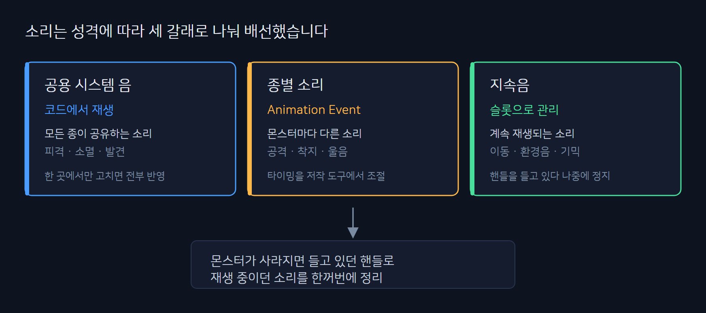
  <br/><sub>소리의 성격에 따라 공용 · 몬스터별 · 지속음 세 갈래로 배선</sub>
</p>

<details>
<summary><b>세부 구현 사항</b></summary>

**사운드 핸들**
- `CSound_Handle`은 FMOD 채널을 감싼 값 타입 핸들로,<br/>
  소리를 내는 쪽이 채널 포인터를 직접 들고 있지 않게 함
- 이미 끝난 채널에 대한 호출은 FMOD 2.x의 핸들 검사가 무효로 돌려주는 동작에 맡기고,<br/>
  래퍼는 널 검사와 정지 · 재생 여부 확인 때의 반환값 검사만 맡음
- 루프 재생 · BGM 페이드 · 구간 반복 BGM API 추가

<sub>코드 · [`CSound_Handle`](https://github.com/ddoichaboom/DX11_3D_GameProject_Team/blob/5cf52376ca5d1a02ebb6c31256e7fa08ef0c6b49/AAA/Engine/Public/Sound_Handle.h#L12-L32) · [`Sound_Handle.cpp`](https://github.com/ddoichaboom/DX11_3D_GameProject_Team/blob/5cf52376ca5d1a02ebb6c31256e7fa08ef0c6b49/AAA/Engine/Private/Sound_Handle.cpp)</sub>

**같은 소리 중첩 제한**
- 같은 효과음이 60ms 안에 몰려 재생되면 3번까지만 재생하고 나머지는 건너뜀
- 겹칠 때마다 볼륨을 0.6배씩 낮춰(1 → 0.6 → 0.36) 겹친 소리가 커지지 않게 함
- 건너뛴 요청은 시각을 갱신하지 않아, 요청이 계속 몰려도 마지막 재생에서 60ms가 지나면 다시 재생
- 루프 · BGM은 제외하고 단발 효과음에만 적용

<sub>코드 · [`CSound_Manager::Gate_Sound`](https://github.com/ddoichaboom/DX11_3D_GameProject_Team/blob/5cf52376ca5d1a02ebb6c31256e7fa08ef0c6b49/AAA/Engine/Private/Sound_Manager.cpp#L86-L105) · [제한 수치](https://github.com/ddoichaboom/DX11_3D_GameProject_Team/blob/5cf52376ca5d1a02ebb6c31256e7fa08ef0c6b49/AAA/Engine/Public/Sound_Manager.h#L82-L84) · [적용 조건](https://github.com/ddoichaboom/DX11_3D_GameProject_Team/blob/5cf52376ca5d1a02ebb6c31256e7fa08ef0c6b49/AAA/Engine/Private/Sound_Manager.cpp#L113-L117)</sub>

**전체 음량 · 채널 관리**
- 마스터 버스에 FMOD 리미터를 걸어, 여러 소리가 합쳐져도 출력이 상한(−0.5dB)을 넘지 않게 함
- 버스별 채널 우선순위를 BGM > 환경음 > UI > 음성 > 효과음 순으로 지정해,<br/>
  채널이 모자라면 효과음부터 밀려나게 함

<sub>코드 · [리미터](https://github.com/ddoichaboom/DX11_3D_GameProject_Team/blob/5cf52376ca5d1a02ebb6c31256e7fa08ef0c6b49/AAA/Engine/Private/Sound_Manager.cpp#L40-L46) · [버스별 우선순위](https://github.com/ddoichaboom/DX11_3D_GameProject_Team/blob/5cf52376ca5d1a02ebb6c31256e7fa08ef0c6b49/AAA/Engine/Private/Sound_Manager.cpp#L127-L134)</sub>

**배선**
- 몬스터 공용 사운드 헬퍼와 몬스터별 사운드 맵을 두고, 보스까지 같은 방식으로 배선
- 몬스터가 비활성화되면 재생 중이던 루프 사운드를 일괄 정지

<sub>코드 · [CMonster 사운드 헬퍼](https://github.com/ddoichaboom/DX11_3D_GameProject_Team/blob/5cf52376ca5d1a02ebb6c31256e7fa08ef0c6b49/AAA/GameContent/Private/Monster.cpp#L986-L1043) · [`CMonster::Set_Active`](https://github.com/ddoichaboom/DX11_3D_GameProject_Team/blob/5cf52376ca5d1a02ebb6c31256e7fa08ef0c6b49/AAA/GameContent/Private/Monster.cpp#L150-L159)</sub>

**구역 오브젝트 (AudioArea)**
- 레벨 담당이 만든 구역 오브젝트(트리거 · 배치 데이터 파싱 · 사운드 매핑 표 구조)에 재생 로직을 구현
- 원작 배치 데이터의 구역 이름 · 변종 값으로 매핑 표에서 사운드 · 재생 방식 · 볼륨 · 감쇠 거리를 찾음
- 원작 데이터에는 있지만 등록되지 않아 생성되지 않던<br/>
  구역 4종(수도관 · 용암 폭포 · 모래 폭포 · 월드맵)을 등록
- 매핑 표에 감쇠 거리 항목을 추가하고, BGM 구역 1종과 정글 · 파도 · 용암 폭포 · 마을 등 환경음 12종을 연결

<sub>코드 · [사운드 매핑 표](https://github.com/ddoichaboom/DX11_3D_GameProject_Team/blob/5cf52376ca5d1a02ebb6c31256e7fa08ef0c6b49/AAA/GameContent/Private/LD_AudioArea.cpp#L33-L48)</sub>

**BGM 구역**
- 원작 맵 데이터에서 구역의 사운드 번호가 스테이지 BGM 목록의 인덱스라는 것을 확인해 해당 트랙을 연결
- 들어가면 원작 데이터의 페이드 인 프레임만큼 BGM을 키우고, 나가면 비활성 프레임만큼 줄임
- 다 줄어들면 정지하지 않고 일시정지해, 다시 들어오면 멈췄던 위치부터 이어서 재생
- 같은 BGM이 이미 재생 중이면 처음부터 다시 틀지 않고 기존 채널을 그대로 사용

<sub>코드 · [`CLD_AudioArea::Request_BGM`](https://github.com/ddoichaboom/DX11_3D_GameProject_Team/blob/5cf52376ca5d1a02ebb6c31256e7fa08ef0c6b49/AAA/GameContent/Private/LD_AudioArea.cpp#L300-L327) · [`Update_BgmFadeOut`](https://github.com/ddoichaboom/DX11_3D_GameProject_Team/blob/5cf52376ca5d1a02ebb6c31256e7fa08ef0c6b49/AAA/GameContent/Private/LD_AudioArea.cpp#L403-L428) · [`CSound_Manager::Play_BGM_Fade`](https://github.com/ddoichaboom/DX11_3D_GameProject_Team/blob/5cf52376ca5d1a02ebb6c31256e7fa08ef0c6b49/AAA/Engine/Private/Sound_Manager.cpp#L255-L279) · [`Resume_BGM_Fade`](https://github.com/ddoichaboom/DX11_3D_GameProject_Team/blob/5cf52376ca5d1a02ebb6c31256e7fa08ef0c6b49/AAA/Engine/Private/Sound_Manager.cpp#L281-L300)</sub>

**환경음 구역**
- 볼륨 0으로 루프 재생을 시작해 두고, 매 프레임 플레이어와 구역 상자 표면 사이의 최단 거리로 볼륨을 계산
- 축마다 중심과의 거리에서 상자 반 크기를 빼(안쪽이면 0) 표면까지 거리를 구하고,<br/>
  감쇠 거리에 대해 선형으로 줄임
- 구역 안에서는 최대 볼륨, 감쇠 거리 밖에서는 0
- 핸들을 유지한 채 볼륨만 바꿔, 구역을 오가도 소리가 끊기거나 처음부터 다시 나오지 않음

<sub>코드 · [`CLD_AudioArea::Update_Proximity`](https://github.com/ddoichaboom/DX11_3D_GameProject_Team/blob/5cf52376ca5d1a02ebb6c31256e7fa08ef0c6b49/AAA/GameContent/Private/LD_AudioArea.cpp#L341-L401)</sub>

</details>

<details>
<summary><b>설계 고민</b></summary>

**채널을 값 타입 핸들로 감싼 이유**
- 몬스터 · 구역마다 채널 포인터를 그대로 들고 있으면 이미 끝난 소리를 건드릴 위험이 있어,<br/>
  정지 · 볼륨 · 일시정지를 핸들 하나로만 다루게 함
- 끝난 채널은 FMOD 2.x가 핸들 검사로 걸러 주므로,<br/>
  래퍼는 얇게 두고 복사해 들고 다닐 수 있는 값 타입으로 만듦

**구역 안에서만 켜지 않고 거리로 줄인 이유**
- 처음에는 구역 안에 들어가면 켜는 방식도 함께 설계했지만,<br/>
  실제로 확인해 보니 정글 구역 상자가 정글 전체가 아니라 소리가 나는 일부만 덮고 있었음
- 상자를 음원 영역으로 보고 밖에서도 거리에 따라 줄어들며 들리게 하는 편이 자연스러워,<br/>
  모든 환경음 구역을 거리 기반으로 통일
- BGM 구역만 진입 · 이탈 시 페이드로 처리

**환경음 감쇠 값**
- 원작 배치 데이터에 감쇠 거리가 없다는 것을 확인하고 설계값으로 정함
- 정글 · 파도 두 구역 사이에 소리가 끊기는 구간이 없도록,<br/>
  두 감쇠 거리의 합이 구역 간격(84.5) 이상이 되게 조정
- 70 / 50에서 시작해 음량과 함께 조정하며 최종 50 / 40(합 90)으로 맞춤

</details>

### 10. 거리 기반 애니메이션 갱신 주기

성능 개선을 목적으로, 멀리 있어 잘 보이지도 않는 몬스터까지 매 프레임 뼈 애니메이션을 계산하지 않도록<br/>
**카메라와의 거리에 따라 애니메이션을 몇 프레임마다 갱신할지 정하는 로직**을 직접 설계했습니다.<br/>
렌더 컬링은 맵 담당이 만든 컬링 틀을 그대로 활용했습니다.

| 카메라 ~ 몬스터 표면 거리 | 애니메이션 갱신 | 60fps 기준 |
| --- | --- | ---: |
| 65 미만 | 매 프레임 | 초당 60회 |
| 65 ~ 80 | 2프레임마다 | 초당 30회 |
| 80 이상 (화면에 보이는 범위) | 4프레임마다 | 초당 15회 |
| 컬링 거리 밖 (렌더 제외) | 8프레임마다 | 초당 7.5회 |

<p align="center">
  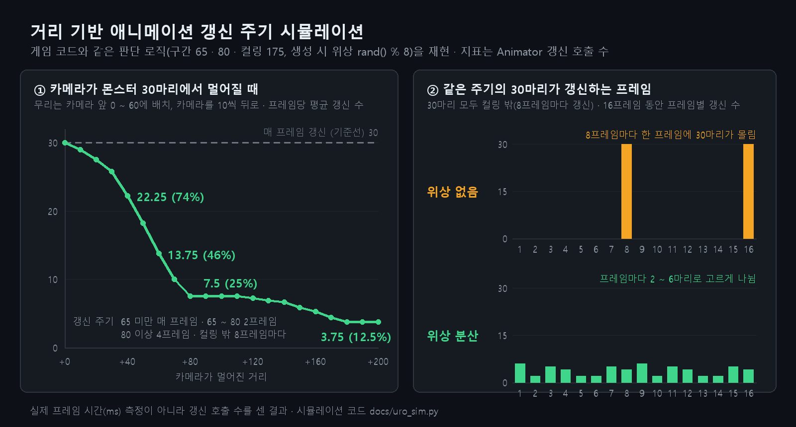
  <br/><sub>게임 코드와 같은 판단 로직을 재현한 시뮬레이션 (Animator 갱신 호출 수 기준)<br/>카메라가 멀어질수록 갱신 수가 25% · 12.5%까지 줄고, 위상을 나누면 같은 주기의 몬스터도 한 프레임에 몰리지 않음</sub>
</p>

<details>
<summary><b>세부 구현 사항</b></summary>

**판단과 소비 분리**
- 몬스터 본체가 매 프레임 거리 구간 → 갱신 주기 → 이번 프레임이 갱신 차례인지를 계산해<br/>
  `MONSTER_CULL_STATE`에 기록
- 몸체 · 모자 같은 파츠(`CMonsterPart`)는 이 값을 읽고 Animator 갱신 여부와 넘길 시간만 결정
- 파츠가 여럿이어도 판단은 한 번

<sub>코드 · [`MONSTER_CULL_STATE`](https://github.com/ddoichaboom/DX11_3D_GameProject_Team/blob/5cf52376ca5d1a02ebb6c31256e7fa08ef0c6b49/AAA/GameContent/Public/MonsterPart.h#L11-L17) · [`CMonster::Calc_AnimPeriod`](https://github.com/ddoichaboom/DX11_3D_GameProject_Team/blob/5cf52376ca5d1a02ebb6c31256e7fa08ef0c6b49/AAA/GameContent/Private/Monster.cpp#L607-L615) · [`CMonsterPart::Update`](https://github.com/ddoichaboom/DX11_3D_GameProject_Team/blob/5cf52376ca5d1a02ebb6c31256e7fa08ef0c6b49/AAA/GameContent/Private/MonsterPart.cpp#L29-L41)</sub>

**건너뛴 시간 누적**
- 갱신하지 않은 프레임의 시간을 누적해 두었다가 갱신 프레임에 한 번에 넘김
- 갱신 횟수만 줄고 애니메이션 진행 속도는 그대로 (4프레임마다 갱신하면 4프레임 분량을 한 번에 진행)
- 렌더에서 빠진 몬스터도 애니메이션을 멈추지 않고 8프레임마다 진행

**위상 분산**
- 몬스터마다 생성할 때 시작 위상(0 ~ 7)을 무작위로 정해,<br/>
  같은 주기의 몬스터들이 같은 프레임에 몰려 갱신되지 않게 함
- 같은 종류의 몬스터가 같은 거리에 모여 있어도 위상이 서로 달라, 갱신 차례가 여러 프레임으로 나뉨
- 시뮬레이션에서 30마리가 모두 8프레임 주기일 때, 위상이 없으면 8프레임마다 한 프레임에 30마리가<br/>
  한꺼번에 갱신되고 나머지 7프레임은 0이었지만, 위상을 나누면 프레임마다 2 ~ 6마리로 고르게 분산

<sub>코드 · [`m_iCullPhase = rand() % 8`](https://github.com/ddoichaboom/DX11_3D_GameProject_Team/blob/5cf52376ca5d1a02ebb6c31256e7fa08ef0c6b49/AAA/GameContent/Private/Monster.cpp#L46)</sub>

```
프레임               1  2  3  4  5  6  7  8
몬스터 A (위상 3)    ■  ·  ·  ·  ■  ·  ·  ·     같은 거리 · 같은 주기(4)여도
몬스터 B (위상 1)    ·  ·  ■  ·  ·  ·  ■  ·     갱신하는 프레임이 서로 다름
```

**시뮬레이션으로 확인**
- 실제 프레임 시간을 재는 대신, 게임 코드와 같은 판단 로직을 옮긴 시뮬레이션으로<br/>
  Animator 갱신 호출 수를 비교 (거리 구간 65 · 80 · 컬링 175, 생성 시 위상, 건너뛴 시간 누적)
- 기준선은 모든 구간을 매 프레임 갱신하는 경우(`s_bUseAnimURO`를 끈 상태와 같음)
- 카메라 앞 0 ~ 60에 모인 30마리에서 카메라가 멀어질수록,<br/>
  프레임당 평균 갱신 수가 30 → 13.75(46%) → 7.5(25%) → 3.75(12.5%)로 줄어듦
- 프레임 시간을 잰 값이 아니라 갱신 횟수이므로, 설계한 구조가 의도대로 동작하는지 확인하는 용도

<sub>코드 · [`uro_sim.py`](docs/uro_sim.py)</sub>

**예외 처리**
- 컬링 거리를 설정하지 않은 몬스터나 거리 계산이 실패한 경우는 매 프레임 갱신해,<br/>
  갱신 주기 조절이 동작을 망가뜨리지 않게 함
- 에디터 모드에서는 시간을 누적하지 않음
- `s_bUseAnimURO` 스위치 하나로 모든 구간을 매 프레임 갱신으로 되돌려 전후 비교

```cpp
// CMonster::Update_CullGrade (요약)
const _uint iPeriod = Calc_AnimPeriod(tFade.fBoundaryDistance);    // 거리 구간 → 갱신 주기 (1 · 2 · 4 · 8)
m_fAnimAccum += fTimeDelta;                                         // 이번 프레임 시간 누적
++m_iCullFrame;
m_CullState.bAnimTick = (iPeriod <= 1)
    || (0 == ((m_iCullFrame + m_iCullPhase) % iPeriod));            // 몬스터마다 위상을 어긋나게
if (m_CullState.bAnimTick)
{
    m_CullState.fAnimDt = m_fAnimAccum;                             // 건너뛴 시간을 한 번에 전달
    m_fAnimAccum = 0.f;
}
```

<sub>코드 · [`CMonster::Update_CullGrade`](https://github.com/ddoichaboom/DX11_3D_GameProject_Team/blob/5cf52376ca5d1a02ebb6c31256e7fa08ef0c6b49/AAA/GameContent/Private/Monster.cpp#L555-L605)</sub>

</details>

<details>
<summary><b>설계 고민</b></summary>

**설계의 출발점**
- 원작에서 멀리 있는 몬스터가 디더링으로 서서히 사라지는 것을 보고,<br/>
  하나의 정책으로 단계마다 애니메이션 갱신을 줄이다가 마지막에 렌더를 끄는 구조로 설계
- 언리얼의 URO와 같은 계열이며, 오클루전 · GPU 컬링은 스테이지당 수십 마리 규모에는 과하다고 보고 제외

**평균만 줄이면 생기는 프레임 튐**
- 거리 구간마다 주기만 나누면, 같은 구간에 있는 몬스터들이 같은 프레임에 한꺼번에 갱신됨
- 평균 갱신 수는 줄어도 몇 프레임에 한 번씩 그 프레임만 무거워지는 튐이 생기므로,<br/>
  생성 시 위상을 무작위로 줘서 갱신을 프레임마다 고르게 나눔

**지켜야 했던 조건**
- 시간을 누적하지 않고 건너뛰기만 하면<br/>
  애니메이션이 느려지고(4프레임 주기면 1/4 배속) AI 타이머와도 어긋남
- 파츠마다 따로 판단하면 같은 몬스터의 뼈가 서로 어긋나서, 판단은 반드시 몬스터 단위로 함
- 렌더에서 빠져도 완전히 멈추면 애니메이션 종료를 기다리는 상태가 멈추고<br/>
  레일 몬스터의 이벤트가 끊겨, 8프레임 주기로 계속 진행

**엔진 컬링 컴포넌트를 쓰지 않은 이유**
- 구간 판단에 필요한 연속 거리 값을 내주지 않고, 몬스터는 매 프레임 움직여 캐시 이점도 없음
- 대신 거리 · 페이드 값을 한 번에 돌려주는 거리 페이드 함수만 사용

</details>

> 렌더 컬링과 거리 페이드 계산(`Evaluate_DistanceFade`)은 맵 담당이 만든 컬링 틀이고,<br/>
> 몬스터에는 이를 적용해 컬링 거리 앞 구간에서 디더링으로 서서히 사라지게 했습니다.

---

## 구현 콘텐츠

### 몬스터

몬스터 16종을 구현했습니다. 14종은 전용 판단 · 상태를 갖고, 2종은 공용 상태만으로 동작합니다.

| 분류 | 몬스터 | 특징 |
| --- | --- | --- |
| 근접 · 추격 | BladeKnight | 고정형 · 추격형 변종, 검 공격 · 회오리 |
| | NormalEnemy · NormalEnemyWild | 순찰 · 추격 (NormalEnemy는 표정 애니메이션 이벤트) |
| | Noddy | 감지 시퀀스 |
| 레일 이동 | Kabu | 원작 배치 레일을 따라 이동, 밀려나면 사라졌다 레일 위에 다시 등장 |
| | BrontoBurt | 공중 레일 비행 |
| 투척 · 발사 | PoppyBrosJr | 애니메이션 이벤트로 폭탄을 손 뼈에 붙였다가 던짐 |
| | EnemyBomb | 튀며 굴러가는 폭탄, 흡입하면 폭탄 능력 |
| | Dekabu · KoKabu | 애니메이션 이벤트 시점에 KoKabu 발사 |
| | Gigatzo | 고정 포탑, 코스터 위 표적 예측 발사 |
| 점프 | Bouncy · RabbitEnemy | 점프 이동 |
| 기타 | Cappy | 모자가 분리되는 2단 구조 |
| | SirKibble · RangerEnemy | 공용 상태만으로 동작 |

본문에 나오지 않은 몬스터만 모았습니다.<br/>
NormalEnemy · BladeKnight · Kabu · BrontoBurt · Gigatzo는 주요 구현의 GIF에서 볼 수 있습니다.

<table>
  <tr>
    <td width="50%">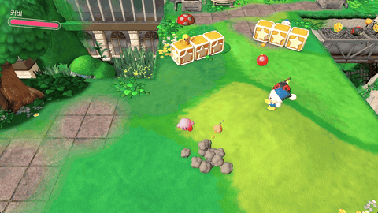<br/><sub><b>PoppyBrosJr</b><br/>폭탄을 손에 붙였다가 던짐</sub></td>
    <td width="50%">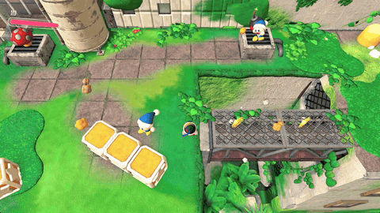<br/><sub><b>EnemyBomb</b><br/>튀며 굴러가는 폭탄</sub></td>
  </tr>
  <tr>
    <td>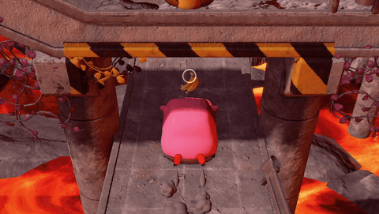<br/><sub><b>Dekabu</b><br/>KoKabu 발사</sub></td>
    <td>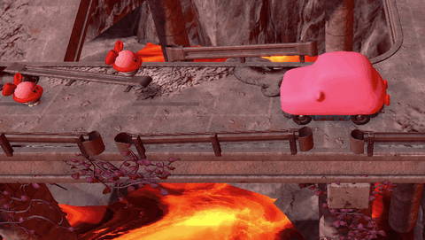<br/><sub><b>Bouncy</b><br/>점프하며 이동</sub></td>
  </tr>
</table>

### 이펙트

이펙트 시스템 코어(로더 · 컨테이너 · 이미터)는 팀원이 만들었고,<br/>
그 위에서 몬스터 · 보스 · 기믹에 쓰이는 개별 이펙트 30종을 만들어 배선했습니다.

<table>
  <tr>
    <td width="50%">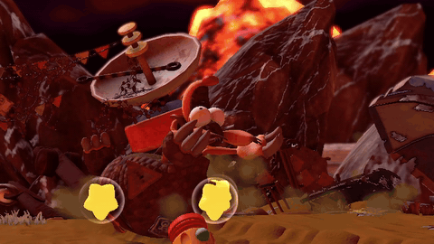<br/><sub><b>FaintEffect</b> — 벽에 부딪혀 기절한 아르마딜로 머리 위를 도는 별</sub></td>
    <td width="50%">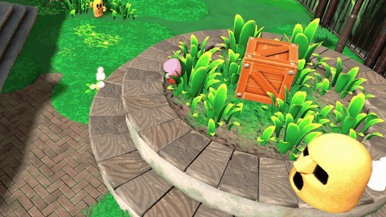<br/><sub><b>MoveSmoke</b> — 굴러가는 Kabu 뒤로 남는 먼지</sub></td>
  </tr>
  <tr>
    <td>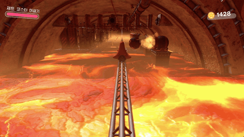<br/><sub><b>GigatzoAttackEffect</b> — 포탑이 쏠 때 포구 화염</sub></td>
    <td>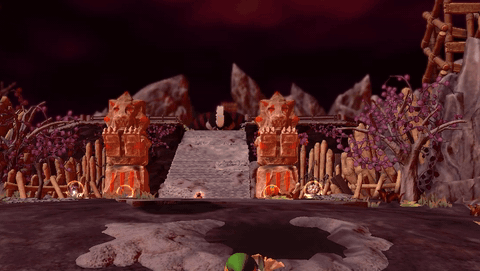<br/><sub><b>MeteorExplosion</b> — 낙하암이 착지하며 터지는 폭발</sub></td>
  </tr>
</table>

아래 표는 그중 주요 21종입니다.

| 분류 | 이펙트 |
| --- | --- |
| 피격 · 소멸 | CommonHit · HitMark · SwordHitEffect · DespawnEffect |
| 폭발 · 공격 | BombExplosion · BombFuseEffect · MeteorExplosion · GigatzoAttackEffect · GigatzoBreakEffect |
| 먼지 · 이동 | LaunchSmoke · LandingSmoke · MoveSmoke · WarpInEffect |
| 오라 · 상태 | BubbleAura · EssenceAura · MeteorAura · FaintEffect |
| 획득 · 별 | PickUpEffect · DropStarEffect · StarParticle · Sparkle |

---

## 툴

| 툴 | 위치 | 하는 일 |
| --- | --- | --- |
| **AnimModelTool** (C#) | 레포 밖 | 원작 `.bfres` → `.ysh` · `.AnimClips` 변환, 11개 명령, 배치 메뉴 |
| **AnimUITool** (C++) | `AAA/AnimUITool` | 애니메이션 이벤트 저작 · 게임 객체 테스트,<br/>모델 · 렌더 확인, 초기 UI 배치 모드 |
| **SoundMatchTool** (C#) | 레포 밖 | 게임 소리를 실시간으로 듣고 원본 사운드 파일을 찾아 줌<br/>(오디오 지문 매칭 · 세션 녹화 · HTML 리뷰) |
| **TextureRebake**<br/>**BfresTextureRebake** | 레포 밖 | 텍스처 색공간(sRGB / linear) 검사 · 재변환,<br/>원작 내장 텍스처를 원래 포맷 그대로 `.dds`로 추출 |
| **SpriteFontTool** | 레포 밖 | DirectXTK MakeSpriteFont에 폰트 파일 로딩을 추가한 수정본 |
| **EncodingCheck** | 레포 밖 | CP949 · UTF-8이 섞인 레포에서<br/>변경 파일의 인코딩 사고(깨짐 · BOM · 줄바꿈) 검사 |
| **이펙트 텍스처 검색기** | 레포 밖 | 추출한 이펙트 텍스처 3,773장을 HTML 썸네일로 검색 |

---

## 트러블 슈팅

### 1. 롤러코스터 위 커비를 포탑이 맞히지 못하던 문제

**문제**
- 고정 포탑이 감지 즉시 발사해, 코스터 속도(14 ~ 60) 변화에 따라 탄이 앞뒤로 빗나감

**원인**
- 탄이 날아가는 동안 표적이 이동하는 거리를 반영하지 않음

**1차 해결 (07-29)**
- 표적 속도를 프레임 간 위치 차로 구함
- `속도 × (발사 애니메이션 시간 + 수직 거리 / 탄속)`만큼 앞을 노리도록 변경
- 표적이 지나갈 때 한 발만 쏘도록 래치 추가

**2차 해결 (07-31)**
- 1차 식은 등속을 가정해, 코스터가 가속 · 감속하는 구간에서 맞지 않음
- 표적 경로와 포신 직선의 최근접점으로 탄의 비행 거리를 구하고,<br/>
  가속도를 반영한 이동 거리로 리드 계산 ([주요 구현 7](#7-포탑-예측-발사--낙하암))

<sub>코드 · [`CGigatzo_Brain::Decide`](https://github.com/ddoichaboom/DX11_3D_GameProject_Team/blob/5cf52376ca5d1a02ebb6c31256e7fa08ef0c6b49/AAA/GameContent/Private/Gigatzo_Brain.cpp#L16-L173)</sub>

### 2. 몬스터가 방향을 바꿀 때 메시가 찢어지던 문제

**문제**
- NormalEnemy가 플레이어 쪽으로 즉시 돌아서는 순간 메시가 원근에 맞지 않게 찢어져 보임

**원인**
- 바라볼 점을 `XMLoadFloat3`로 읽어 w = 0이 들어감
- `점 − 자기 위치`의 w가 −1이 되었고, 이 값이 `LookAt` 안에서 정규화된 시선 벡터에 그대로 남음
- 월드 행렬의 시선 행에 w 성분이 생겨 아핀 행렬이 아니게 되었고,<br/>
  정점의 w가 1이 아니게 되어 원근 나눗셈 단계에서 찢어짐

**해결**
- 바라볼 점의 w를 1로 맞춰 `LookAt`에 넘김
- 점은 w = 1, 방향은 w = 0이라는 동차 좌표 규칙을 지키도록 정리

<sub>코드 · [`CMonster_Movement::Face_Instant`](https://github.com/ddoichaboom/DX11_3D_GameProject_Team/blob/5cf52376ca5d1a02ebb6c31256e7fa08ef0c6b49/AAA/GameContent/Private/Monster_Movement.cpp#L50-L63)</sub>

```cpp
// CMonster_Movement (요약)
_vector vAt = XMVectorSetW(XMVectorAdd(vSelf, vDirXZ), 1.f);   // 점은 w = 1
```

---

## 회고

**애니메이션 데이터 포맷**
- 처음에는 원작 애니메이션이 스켈레탈뿐인 줄 알고 모델과 함께 굽는 구조로 설계했음
- 나중에 찾은 표정(텍스처 패턴) · 이벤트 정보가 별도 JSON으로 흩어졌고,<br/>
  모든 계열과 이벤트를 담는 단일 클립 포맷으로 처음부터 설계했다면 더 단순했을 것

**블렌드 도중 재전환 시 끊김**
- 블렌드 도중 다른 클립으로 바뀌면 한 프레임 튀는 원인 2가지를 코드 줄 단위로 찾음<br/>
  (블렌드 시작 포즈가 갱신되지 않음 · 같은 클립이 두 번 진행됨)
- 전환 순간의 포즈를 저장해 시작점으로 쓰는 수정안까지 설계했지만, 프로젝트가 끝나 적용하지 못함

---

## 기술 스택

**언어 · 그래픽스**

| 기술 | 활용 |
| --- | --- |
| C++ | 몬스터 AI 프레임워크 · Animator 레이어 · 사운드 핸들 · 기믹 오브젝트 구현 |
| DirectX 11 / HLSL | 몬스터 디더링 페이드 · 낙하암 착지 · 폭탄 전용 셰이더 |
| C# (.NET) | 원작 리소스 변환 툴 AnimModelTool · 오디오 지문 매칭 툴 SoundMatchTool |

**툴 · 라이브러리**

| 기술 | 활용 |
| --- | --- |
| PhysX | 캐릭터 컨트롤러 기반 이동 컴포넌트를 상속해 몬스터 이동 · 접지 판정 |
| FMOD | 채널 핸들 · 루프 재생 · BGM 페이드 · 구간 반복 BGM |
| ImGui | AnimUITool의 타임라인 · 브라우저 · 팔레트 · 인스펙터 패널 |
| nlohmann/json | 애니메이션 이벤트 · 몬스터 배치 변종 타입 데이터 |
| BfresLibrary | 원작 `.bfres`에서 모델 · 스켈레탈 · 텍스처 패턴 애니메이션 파싱 |
| NAudio | 시스템 오디오 루프백 캡처 · 녹음 |

**자료구조 · 알고리즘**

| 기술 | 활용 |
| --- | --- |
| 해시 맵 | 몬스터별 상태 등록 · 사운드 맵 · 드랍 별 프리셋 이름 조회 |
| 오브젝트 풀 | 드랍 별 · 능력 방울을 미리 만들어 두고 재사용 |
| 덱(재생 큐) | 다음 애니메이션 클립을 예약해 순차 재생 |
| 최근접점 · 등가속 예측 | 표적 경로와 포신 직선의 최근접점으로 비행 거리, 가속을 반영한 리드 거리 |
| 거리 매개화 | 누적 진행 거리로 레일 구간 · 비율을 찾아 위치와 접선 계산<br/>(원 레일은 호 길이, 나머지는 구간 직선 거리 기준) |
| 균일 원형 샘플링 | 난수의 제곱근으로 원 안 면적에 고르게 배치 |
| 구간별 갱신 주기 · 위상 분산 | 거리 구간마다 애니메이션 갱신 주기를 나누고,<br/>몬스터마다 시작 위상을 달리해 갱신을 프레임에 고르게 분산 |

**설계**

| 기술 | 활용 |
| --- | --- |
| 지각 · 판단 · 실행 분리 | 블랙보드 · Brain · 공용 상태로 몬스터 추가 비용을 판단 코드 수준으로 줄임 |
| 템플릿 메서드 | 이동 상태 베이스에서 추격 · 순찰 · 후퇴가 함수만 오버라이드 |
| 인터페이스 (`IInhalable`) | 팀장이 만든 흡입 인터페이스를 폭탄 · 드랍 별 · 능력 방울 · KoKabu에 구현해 흡입 동작을 통일 |
| 데이터 주도 | 애니메이션 이벤트 JSON · 배치 변종 타입 · 별 배치 프리셋으로 동작을 데이터에서 조정 |

---

> 교육 과정에서 받은 컴포넌트 기반 엔진 프레임워크를 팀이 확장한 비상업적 학습 프로젝트입니다.<br/>
> 「별의 커비」 및 관련 캐릭터의 모든 권리는 닌텐도 및 HAL 연구소에 있으며,<br/>
> 원작 에셋은 저장소에 포함되어 있지 않습니다.
